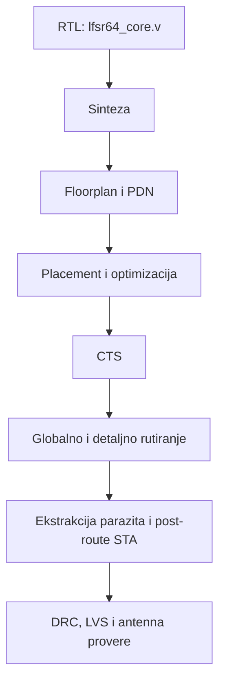

# Detaljan izveštaj o PnR realizaciji modula `lfsr64_core`

**Projekat:** poređenje hardverskih implementacija PRNG algoritama

**Modul:** `lfsr64_core`

**Vrsta eksperimenta:** standalone, core-only, relative-floorplan full PnR

**Tehnologija:** SkyWater SKY130

**Alat i tok:** LibreLane 2.4.2, `Classic`

**Radna frekvencija u eksperimentu:** 50 MHz (`CLOCK_PERIOD = 20 ns`)

**Glavni run:** `relative_u50_d60_50mhz_docker`
**Datum dokumentovanja:** 27. avgust 2026.

---

## 1. Status faze

Da, **kompletan fizički PnR tok za standalone modul `lfsr64_core` uspešno je završen**. LibreLane je izvršio svih 78 koraka toka, napravio fizički raspored i rutiranje, ekstrahovao parazite i završio post-route STA, DRC, LVS i antenna provere.

To ipak ne znači da je završena svaka naredna aktivnost u celom diplomskom projektu. Status treba zapisati precizno:

| Aktivnost | Status | Značenje |
|---|---|---|
| Standalone core-only full physical PnR | **PASS** | svih `78/78` faza završeno; `Flow complete` |
| Post-route multi-corner STA | **PASS** | setup i hold prolaze u sva tri ugla |
| Routing, DRC, LVS i antenna | **PASS** | nema konačnih grešaka |
| Post-route gate-level funkcionalna simulacija | **PENDING** | tek treba potvrditi bit-exact ponašanje fizičkog netlista, po mogućnosti sa SDF-om |
| Activity-aware power i energija po reči | **PENDING** | trenutni power je samo vectorless procena |
| Zajednički PnR za `xoroshiro64ss_core` i `pcg32_oneseq_core` | **PENDING** | treba ponoviti isti protokol |
| Finalni Tiny Tapeout absolute-wrapper PnR | **PENDING** | radi se kasnije nad TT wrapperom i tačnim TT tile/DEF šablonom |

Drugim rečima, zatvoren je **standalone fizički PnR eksperiment za LFSR64**, ali još nije završena finalna Tiny Tapeout integracija niti post-route funkcionalna verifikacija.

---

## 2. Kanonski skup rezultata za kasnije poređenje

Sledeća tabela predstavlja glavni comparison-ready zapis. Za druga dva generatora treba prikupiti iste ključeve i koristiti istu jedinicu i isto značenje.

| Grupa | Metrika | LFSR64 rezultat |
|---|---|---:|
| Identitet | Dizajn | `lfsr64_core` |
| Identitet | LibreLane flow | `Classic`, 78/78 faza |
| Identitet | Run tag | `relative_u50_d60_50mhz_docker` |
| Uslovi | PDK / biblioteka | `sky130A` / `sky130_fd_sc_hd` |
| Uslovi | Period / frekvencija | 20 ns / 50 MHz |
| Floorplan | Režim | `relative` |
| Floorplan | Početni `FP_CORE_UTIL` | 50% |
| Placement | `PL_TARGET_DENSITY_PCT` | 60% |
| Površina | Post-PnR standard-cell area | **7 230.68 µm²** |
| Površina | Core area | **9 819.42 µm²** |
| Površina | Die area | **13 656.8 µm²** |
| Površina | Konačna instance utilization | **73.6366%** |
| Ćelije | Post-PnR standard-cell instances | **782** |
| Ćelije | Sekvencijalne ćelije | **133** |
| Ćelije | Timing-repair bufferi | **236** |
| Ćelije | Hold bufferi | **153** |
| CTS | Clock bufferi / invertori | **18 / 14** |
| Timing | Najgori setup WS | **+9.7022 ns** |
| Timing | Najgori hold WS | **+0.1172 ns** |
| Timing | Setup / hold TNS | **0 / 0 ns** |
| Električke provere | Max slew / max cap prekršaji | **0 / 0** |
| Električke provere | Rezidualni max-fanout prekršaji | **3**, samo na CTS mreži |
| Routing | Finalni wirelength | **10 865 µm** |
| Routing | Broj via | **3 882** |
| Routing | Finalni routing DRC | **0** |
| Signoff | Magic DRC / KLayout DRC | **0 / 0** |
| Signoff | LVS / antenna greške | **0 / 0** |
| Snaga | Vectorless total power | **0.694378 mW**, preliminarno |
| Arhitektura | Ciklusa po 32-bitnoj reči | **32** |
| Arhitektura | Maksimalni protok na 50 MHz | **1.5625 Mword/s** |
| Efikasnost | Protok / post-PnR cell area | **216.09 Mword/s/mm²** |

Ova tabela je kanonska za buduće poređenje. Detaljne vrednosti i ograničenja njihovog tumačenja objašnjeni su u nastavku.

---

## 3. Svrha dokumenta

Dokument beleži:

1. tačan RTL i okruženje iz kojih je PnR pokrenut;
2. potpunu LibreLane konfiguraciju;
3. uspešnu komandu za reprodukciju;
4. rezultate floorplana, placementa, CTS-a, routinga i post-route STA;
5. fizičke signoff provere;
6. značenje i prihvatljivost prijavljenih upozorenja;
7. ograničenja rezultata;
8. metrike koje kasnije treba direktno porediti sa `xoroshiro64ss_core` i `pcg32_oneseq_core`.

Važno metodološko pravilo je da se za sva tri jezgra zadrže isti PDK, biblioteka, LibreLane verzija, takt, SDC ograničenja, synthesis strategija, floorplan princip i placement density. U konfiguraciji drugog jezgra treba promeniti samo identitet dizajna i putanju do njegovog RTL-a.

---

## 4. Šta je urađeno full PnR tokom

RTL sinteza proizvodi gate-level netlist i pre-layout procene. Full place-and-route ide dalje i pravi fizičku implementaciju tog netlista.



Konkretno, tok je:

- proverio RTL lint;
- ponovo sintetizovao RTL strategijom `AREA 0`;
- odredio core i die dimenzije iz relative floorplan uslova;
- postavio I/O pinove i napravio power distribution network;
- fizički rasporedio standardne ćelije;
- dodao i optimizovao bafere;
- izgradio clock tree;
- popravljao setup, hold, slew i capacitance probleme;
- izvršio globalno i detaljno rutiranje;
- ekstrahovao RC parazite iz rutiranog dizajna;
- uradio post-route timing analizu za tri PVT ugla;
- generisao finalne fizičke prikaze, uključujući GDS;
- proverio routing DRC, Magic DRC, KLayout DRC, LVS i antenna pravila.

Zato su dobijeni brojevi fizički realističniji od synthesis-only rezultata: uključuju posledice placementa, realne veze, clock tree, ubačene bafere i ekstrahovane parazite.

---

## 5. Granica ovog eksperimenta

PnR je namerno urađen za sam modul:

```text
lfsr64_core
```

a ne za kompletan Tiny Tapeout wrapper. Ovo je **standalone core-only** eksperiment namenjen objektivnom poređenju tri PRNG jezgra.

Zbog toga je korišćen:

```json
"FP_SIZING": "relative"
```

LibreLane je svakom jezgru dozvolio da dobije core srazmeran sopstvenoj potrebnoj cell area. Takav eksperiment odgovara na pitanje:

> Koliko fizičkih resursa pojedinačno jezgro zahteva kada se realizuje pod istim PnR pravilima?

Ovo nije isto što i finalni Tiny Tapeout tok, koji koristi `absolute` floorplan, tačne dimenzije izabranog tile-a, TT wrapper portove i TT DEF šablon. Zato se trenutne core i die dimenzije ne smeju predstavljati kao konačne dimenzije Tiny Tapeout dizajna.

---

## 6. Ulazni RTL i Git osnova

PnR je pokrenut iz sledećeg stanja repozitorijuma:

| Stavka | Vrednost |
|---|---|
| Polazni branch | `main` |
| Polazni commit | `e73c584` |
| Poruka commita | `Document completion of PRNG RTL synthesis phase` |
| Postojeći tag | `prng-rtl-synthesis-v1` |
| Radni PnR branch | `lfsr64-pnr` |
| RTL fajl | `src/lfsr64_core.v` |

Pre pravljenja konfiguracije potvrđeno je da je radno stablo čisto i da `src/lfsr64_core.v` postoji.

Novi PnR dokument i konfiguracija u trenutku pisanja ovog izveštaja **još nisu proglašeni commit-ovanim niti tagovanim**. Commit i tag treba napraviti tek posle izdvajanja svih dogovorenih rezultata i završne provere promena.

---

## 7. Alati i tehnološko okruženje

| Stavka | Vrednost |
|---|---|
| LibreLane | 2.4.2 |
| Flow | `Classic` |
| PDK | `sky130A` |
| Standard-cell biblioteka | `sky130_fd_sc_hd` |
| Open-PDKs snapshot | `0fe599b2afb6708d281543108caf8310912f54af` |
| Pokretanje EDA alata | Dockerized |
| Paralelizam LibreLane poslova | `-j 1` |

Opcija `-j 1` utiče na način korišćenja računarskih resursa, a ne predstavlja električnu osobinu kola. Zadržana je radi stabilnosti Codespace okruženja i ponovljivosti postupka.

---

## 8. PnR konfiguracija

Napravljen je fajl:

```text
pnr/lfsr64_core/config.json
```

sa sadržajem:

```json
{
  "DESIGN_NAME": "lfsr64_core",
  "VERILOG_FILES": [
    "dir::../../src/lfsr64_core.v"
  ],

  "CLOCK_PORT": "clk_i",
  "CLOCK_PERIOD": 20.0,

  "PDK": "sky130A",
  "STD_CELL_LIBRARY": "sky130_fd_sc_hd",
  "SYNTH_STRATEGY": "AREA 0",

  "FP_SIZING": "relative",
  "FP_CORE_UTIL": 50,
  "FP_ASPECT_RATIO": 1,
  "PL_TARGET_DENSITY_PCT": 60,

  "IO_DELAY_CONSTRAINT": 20,
  "CLOCK_UNCERTAINTY_CONSTRAINT": 0.25,
  "CLOCK_TRANSITION_CONSTRAINT": 0.15,
  "MAX_TRANSITION_CONSTRAINT": 0.75,
  "MAX_FANOUT_CONSTRAINT": 10,
  "OUTPUT_CAP_LOAD": 33.442,
  "TIME_DERATING_CONSTRAINT": 5,

  "DEFAULT_CORNER": "nom_tt_025C_1v80",
  "STA_CORNERS": [
    "nom_tt_025C_1v80",
    "nom_ss_100C_1v60",
    "nom_ff_n40C_1v95"
  ],
  "TIMING_VIOLATION_CORNERS": [
    "nom_tt_025C_1v80",
    "nom_ss_100C_1v60",
    "nom_ff_n40C_1v95"
  ]
}
```

JSON sintaksa je proverena komandom:

```bash
python -m json.tool pnr/lfsr64_core/config.json > /dev/null \
  && echo "PnR config JSON je ispravan"
```

Dobijena je poruka:

```text
PnR config JSON je ispravan
```

---

## 9. Značenje zajedničkih ograničenja

| Parametar | Vrednost | Značenje |
|---|---:|---|
| `CLOCK_PERIOD` | 20 ns | ciljna frekvencija 50 MHz |
| `SYNTH_STRATEGY` | `AREA 0` | zajednički synthesis baseline za sva tri PRNG-a |
| `FP_CORE_UTIL` | 50% | početni cilj za dimenzionisanje relative core-a |
| `FP_ASPECT_RATIO` | 1 | približno kvadratni relative core |
| `PL_TARGET_DENSITY_PCT` | 60% | ciljna gustina globalnog placera |
| `IO_DELAY_CONSTRAINT` | 20% | input i output delay su po 20% perioda, odnosno 4 ns |
| `CLOCK_UNCERTAINTY_CONSTRAINT` | 0.25 ns | rezerva za jitter i neizvesnost takta |
| `CLOCK_TRANSITION_CONSTRAINT` | 0.15 ns | pretpostavljeni slew ulaznog clocka |
| `MAX_TRANSITION_CONSTRAINT` | 0.75 ns | najsporija dozvoljena ivica signala |
| `MAX_FANOUT_CONSTRAINT` | 10 | opšta fanout granica u SDC proveri |
| `OUTPUT_CAP_LOAD` | 33.442 fF | modelovano opterećenje svakog izlaznog porta |
| `TIME_DERATING_CONSTRAINT` | 5% | early/late timing derating |

`FP_CORE_UTIL = 50%` i konačna popunjenost od 73.64% nisu kontradikcija. Prva vrednost služi za početno dimenzionisanje core-a na osnovu sintetizovanih ćelija. Tok posle toga ubacuje clock, hold i timing-repair ćelije, menja veličine ćelija i završava sa većom stvarnom popunjenošću.

---

## 10. Analizirani PVT uglovi

| Oznaka | Proces | Temperatura | Napon | Tipična kritičnost |
|---|---|---:|---:|---|
| `nom_tt_025C_1v80` | typical-typical | 25 °C | 1.80 V | nominalno ponašanje |
| `nom_ss_100C_1v60` | slow-slow | 100 °C | 1.60 V | obično najnepovoljniji setup |
| `nom_ff_n40C_1v95` | fast-fast | -40 °C | 1.95 V | obično najnepovoljniji hold |

Isti uglovi su navedeni u `STA_CORNERS` i `TIMING_VIOLATION_CORNERS`. Time je zahtevano ne samo da alat izračuna rezultate već i da timing prekršaje u sva tri ugla tretira kao relevantne za prolazak toka.

---

## 11. Pokretanje toka i greška prvog pokušaja

### 11.1. Prvi, neuspešni pokušaj

Tok je prvo pokrenut direktno:

```bash
python -m librelane \
  --flow Classic \
  -j 1 \
  --run-tag relative_u50_d60_50mhz \
  pnr/lfsr64_core/config.json
```

LibreLane je prošao prve lint provere, ali se zaustavio na 5. od 78 faza sa:

```text
FileNotFoundError: [Errno 2] No such file or directory: 'yosys'
```

Ovo nije greška RTL-a ni PnR konfiguracije. Python paket LibreLane bio je dostupan u Codespace-u, ali EDA izvršni program `yosys` nije bio instaliran kao lokalna komanda. Taj run nije PnR rezultat i ne koristi se u poređenju.

### 11.2. Uspešan Dockerized run

Posle provere `PDK_ROOT` i Docker-a, tok je pokrenut u kontrolisanom Docker okruženju:

```bash
python -m librelane --dockerized --docker-no-tty \
  --pdk-root "$PDK_ROOT" \
  --flow Classic \
  -j 1 \
  --run-tag relative_u50_d60_50mhz_docker \
  pnr/lfsr64_core/config.json
```

Glavni rezultat nalazi se u:

```text
pnr/lfsr64_core/runs/relative_u50_d60_50mhz_docker/
```

Tok se završio sledećim statusom:

```text
Classic - Stage 78 - Report Manufacturability  78/78  0:02:11
Flow complete.
```

Prikazano trajanje od približno 2 minuta i 11 sekundi zavisi od Codespace mašine i nije metrika hardverskog algoritma.

---

## 12. Lint rezultat

Verilator nije prijavio lint greške, ali je prijavio jedno upozorenje:

```text
%Warning-UNUSEDSIGNAL: src/lfsr64_core.v:28:16:
Bits of signal are not used: 'partial_word_reg'[0]
```

Sažetak je:

| Metrika | Vrednost |
|---|---:|
| Lint errors | 0 |
| Lint timing-construct errors | 0 |
| Lint warnings | 1 |
| Inferred latches | 0 |
| Unmapped instances | 0 |

`partial_word_reg[0]` je poznata posledica LSB-first sklapanja 32-bitne reči: pri pomeranju se prethodna vrednost tog bita namerno odbacuje. Isto upozorenje analizirano je još u synthesis fazi i nije uzrok greške niti funkcionalna promena.

---

## 13. Floorplan i površina

### 13.1. Dimenzije

Iz `metrics.csv` dobijeno je:

| Metrika | Bbox / dimenzije | Površina |
|---|---|---:|
| Die | `(0, 0)` do `(111.625, 122.345)` µm | 13 656.8 µm² |
| Core | `(5.52, 10.88)` do `(105.8, 108.8)` µm | 9 819.42 µm² |

Iz bbox koordinata slede približne dimenzije:

```text
die  = 111.625 µm × 122.345 µm
core = 100.28 µm × 97.92 µm
```

Core je približno kvadratan, što odgovara `FP_ASPECT_RATIO = 1`. Die nije obavezno savršen kvadrat zato što uključuje margine, placement mrežu i tehnološko poravnanje.

### 13.2. Standard-cell area i popunjenost

| Metrika | Vrednost |
|---|---:|
| Post-PnR standard-cell area | 7 230.68 µm² |
| Core area | 9 819.42 µm² |
| Instance utilization | 0.736366 = 73.6366% |
| Slobodan deo core-a prema ovoj metrici | približno 26.36% |

Provera:

```text
7 230.68 / 9 819.42 = 0.736365... ≈ 73.6366%
```

Ovo je post-PnR popunjenost standardnim ćelijama prema LibreLane metrici. Ne treba je mešati sa početnih 50% korišćenih za dimenzionisanje relative core-a niti sa placement ciljem od 60%.

### 13.3. Poređenje sa RTL sintezom

| Faza | Broj standard-cell instanci | Cell area [µm²] |
|---|---:|---:|
| `AREA 0` RTL sinteza | 381 | 5 058.6016 |
| Posle full PnR | 782 | 7 230.68 |
| Apsolutna promena | +401 | +2 172.0784 |
| Relativna promena | +105.25% | +42.94% |

Broj instanci je više nego udvostručen, dok je cell area porasla za približno 42.94%. Razlog je što PnR ubacuje veliki broj relativno malih bafera i invertora radi clock stabla, hold popravki, slew-a, fanout-a i fizičkog tajminga.

Synthesis-only broj od 5 058.6016 µm² zato nije konačna fizička cell area. Za poređenje završenih PnR rezultata treba koristiti post-PnR metriku 7 230.68 µm².

---

## 14. Broj i klase ćelija

| Kategorija | Broj |
|---|---:|
| Post-PnR standard-cell instances | 782 |
| Sekvencijalne ćelije | 133 |
| Multi-input kombinacione ćelije | 248 |
| Timing-repair bufferi | 236 |
| Hold bufferi | 153 |
| Setup bufferi | 0 |
| Clock bufferi | 18 |
| Clock invertori | 14 |
| Filler ćelije | 539 |
| Tap ćelije | 133 |
| Makroi | 0 |

Ove brojeve **ne treba sabirati**. LibreLane ih prikuplja u različitim koracima toka, a neke kategorije se preklapaju. Na primer, hold buffer može istovremeno biti deo šire timing-repair kategorije. Filler i tap ćelije su fizičke pomoćne ćelije i ne predstavljaju funkcionalnu PRNG logiku.

Za fer poređenje sa druga dva generatora treba porediti iste metričke ključeve, a ne pokušavati da se iz mešovitih kategorija ručno rekonstruiše novi ukupni zbir.

Broj sekvencijalnih ćelija ostao je 133, kao u sintetizovanom netlistu. Fizički tok je prvenstveno dodavao kombinacione pomoćne ćelije, a nije menjao arhitektonsko stanje generatora.

---

## 15. Clock-tree synthesis

Pre-layout sinteza koristi idealizovanu clock mrežu. U PnR-u je izveden CTS, pa je takt fizički distribuiran do registara pomoću:

| CTS resurs | Broj |
|---|---:|
| Clock bufferi | 18 |
| Clock invertori | 14 |

Post-route metrike clock skew-a su:

| Ugao | Worst setup skew [ns] | Worst hold skew [ns] |
|---|---:|---:|
| `nom_tt_025C_1v80` | +0.255602 | -0.258213 |
| `nom_ss_100C_1v60` | +0.258692 | -0.261554 |
| `nom_ff_n40C_1v95` | +0.254369 | -0.256206 |

Skew opisuje razliku u vremenu dolaska clocka do različitih sekvencijalnih elemenata. Njegov uticaj je već uključen u post-route setup i hold rezultate prikazane u narednom odeljku.

---

## 16. Post-route statička vremenska analiza

### 16.1. Sažetak po uglovima

| Ugao | Setup WS [ns] | Hold WS [ns] | Setup TNS [ns] | Hold TNS [ns] | Setup vio. | Hold vio. | Max slew | Max cap | Max fanout |
|---|---:|---:|---:|---:|---:|---:|---:|---:|---:|
| Overall | **+9.7022** | **+0.1172** | 0.0000 | 0.0000 | 0 | 0 | 0 | 0 | 3 |
| `nom_tt_025C_1v80` | +10.6110 | +0.3408 | 0.0000 | 0.0000 | 0 | 0 | 0 | 0 | 3 |
| `nom_ss_100C_1v60` | +9.7022 | +0.9422 | 0.0000 | 0.0000 | 0 | 0 | 0 | 0 | 3 |
| `nom_ff_n40C_1v95` | +10.9816 | +0.1172 | 0.0000 | 0.0000 | 0 | 0 | 0 | 0 | 3 |

`WS` označava najgori prijavljeni slack. Pozitivna vrednost znači da je uslov ispunjen. LibreLane odvojena `WNS` polja vodi kao nulu kada nema negativnih putanja, dok `WS` čuva stvarnu pozitivnu rezervu.

### 16.2. Setup zaključak

Najmanji setup slack je:

```text
+9.7021549096 ns u nom_ss_100C_1v60 uglu
```

To je očekivano: spori proces, visoka temperatura i niži napon tipično daju najveća kašnjenja. Setup TNS je nula i nema setup prekršaja.

### 16.3. Hold zaključak

Najmanji hold slack je:

```text
+0.1172402764 ns u nom_ff_n40C_1v95 uglu
```

To je takođe očekivano: brze ćelije na niskoj temperaturi i višem naponu najčešće su nepovoljne za hold. Hold TNS je nula i nema hold prekršaja.

Pre-layout hold rezerva bila je samo +0.0458 ns. Posle CTS-a, rutiranja i automatskog ubacivanja 153 hold bafera, najgora post-route rezerva je +0.1172 ns. To pokazuje da je fizički tok uspešno popravio kratke LFSR shift puteve.

### 16.4. Šta se ne sme zaključiti

Velika rezerva pri periodi 20 ns potvrđuje rad na 50 MHz pod korišćenim ograničenjima, ali ne određuje maksimalnu frekvenciju. Za validan `Fmax` potreban je poseban sweep perioda sa ponavljanjem celog synthesis + PnR toka.

U sažetku je register-to-register setup polje `N/A`/`Infinity`, pa se ni iz njega ne sme izvlačiti procena `Fmax`. Kanonski zaključak je samo:

> Post-route implementacija zadovoljava setup i hold zahteve na 50 MHz u sva tri analizirana ugla.

---

## 17. Tri max-fanout upozorenja

Finalni `checks.rpt` prikazuje:

| Pin clock buffer-a | Limit | Fanout | Fanout slack | Status |
|---|---:|---:|---:|---|
| `clkbuf_0_clk_i/X` | 10 | 16 | -6 | violated |
| `clkbuf_4_15_0_clk_i/X` | 10 | 13 | -3 | violated |
| `clkbuf_4_10_0_clk_i/X` | 10 | 12 | -2 | violated |

Ovde `slack` nije vreme u nanosekundama. Računa se kao:

```text
fanout slack = dozvoljeni fanout - stvarni fanout
```

Na primer:

```text
10 - 16 = -6
```

Sva tri prekršaja nalaze se isključivo na automatski napravljenoj CTS clock mreži. Ista tri fizička pina proveravaju se u sva tri PVT ugla; zato rezultat ne predstavlja devet različitih problema.

LibreLane generički SDC proverava `MAX_FANOUT_CONSTRAINT = 10`, dok CTS grupisanje sinkova podrazumevano koristi `CTS_SINK_CLUSTERING_SIZE = 25`. Zbog toga CTS može da napravi clock granu sa 12–16 sinkova, a da kasniji opšti fanout checker ipak prijavi prekoračenje granice 10. Ovo ponašanje može se proveriti u [LibreLane 2.4.2 `base.sdc`](https://github.com/librelane/librelane/blob/2.4.2/librelane/scripts/base.sdc), [CTS promenljivama](https://github.com/librelane/librelane/blob/2.4.2/librelane/steps/openroad.py) i [OpenROAD CTS dokumentaciji](https://openroad.readthedocs.io/en/latest/main/src/cts/README.html).

Run se ipak prihvata kao validan zato što istovremeno važi:

- nema max-slew prekršaja;
- nema max-capacitance prekršaja;
- setup i hold prolaze;
- nema disconnected pinova;
- routing, DRC, LVS i antenna su čisti.

Slew i capacitance direktnije opisuju da li clock buffer može električki da pobudi konkretno opterećenje. Zato rezidualni CTS fanout predstavlja dokumentovano upozorenje, a ne dokaz neispravnosti kola.

Za kasnije poređenje treba zabeležiti broj i veličinu ovakvih CTS prekoračenja za sva tri jezgra. Ne treba menjati samo LFSR konfiguraciju, jer bi to narušilo jednakost eksperimenta.

---

## 18. Routing rezultat

### 18.1. Osnovne metrike

| Metrika | Vrednost |
|---|---:|
| Ukupan broj rutiranih netova | 637 |
| Special netovi | 2 |
| Procenjeni wirelength pre detaljnog rutiranja | 9 936.35 µm |
| Konačni wirelength | 10 865 µm |
| Najduža prijavljena veza | 250.29 µm |
| Ukupan broj via | 3 882 |
| Single-cut via | 3 882 |
| Multi-cut via | 0 |
| Disconnected pins | 0 |
| Critical disconnected pins | 0 |

Wirelength i broj via su važne fizičke metrike. Veće vrednosti obično ukazuju na više parazitskog R i C, veću routing složenost i potencijalno veću dinamičku snagu. Pravi značaj će se videti tek kada iste metrike dobijemo za druga dva generatora.

### 18.2. Iterativno uklanjanje DRC problema

Detailed router je tokom optimizacije prijavio:

| Iteracija | Routing DRC errors | Wirelength [µm] |
|---:|---:|---:|
| 1 | 202 | 11 035 |
| 2 | 17 | 10 915 |
| 3 | 16 | 10 871 |
| 4 | **0** | **10 865** |

Privremene greške u prvoj iteraciji nisu konačni DRC rezultat. Router ih je reroutingom i optimizacijom smanjio na nulu. Za validnost se koristi poslednja iteracija.

---

## 19. Ekstrakcija parazita i `GRT-0097`

U tri mid-PnR STA loga pojavilo se:

```text
[WARNING GRT-0097] No global routing found for nets.
```

To upozorenje se javilo u međufaznim timing koracima pre završenog globalnog i detaljnog rutiranja. Tri pojavljivanja predstavljaju tri slična STA poziva u toku, a ne dokaz da su na kraju ostala tri nerutirana neta.

Finalne metrike pokazuju:

```text
route__drc_errors = 0
design__disconnected_pin__count = 0
design__critical_disconnected_pin__count = 0
```

Zato `GRT-0097` nije problem konačnog rezultata.

STA je takođe sirovo prikazao 15 `clkload*` unannotated drivera po uglu, ali metrike navode:

| Metrika | Vrednost |
|---|---:|
| Raw unannotated-net count | 15 |
| Unannotated-net filtered count | 0 |

U dokumentaciji rezultata to se tretira kao interni clock-load artefakt koji je filter uklonio iz relevantnog skupa; nema konačnog nerutiranog ili kritično neanotiranog neta.

---

## 20. Fizičke i proizvodne provere

| Provera | Rezultat |
|---|---:|
| Finalni OpenROAD routing DRC | 0 |
| Magic DRC | 0 |
| KLayout DRC | 0 |
| Magic illegal overlaps | 0 |
| LVS device differences | 0 |
| LVS net differences | 0 |
| LVS property failures | 0 |
| Ukupan LVS error count | 0 |
| Unmatched LVS devices / nets / pins | 0 / 0 / 0 |
| Antenna violating nets | 0 |
| Antenna violating pins | 0 |
| Antenna diode count | 0 |
| Power-grid violations, `VPWR` | 0 |
| Power-grid violations, `VGND` | 0 |
| XOR difference count | 0 |

LibreLane završni sažetak zato prikazuje:

```text
* Antenna
Passed

* LVS
Passed

* DRC
Passed
```

Ovo potvrđuje da je standalone fizička realizacija geometrijski i topološki konzistentna prema korišćenim proverama.

LVS potvrđuje da izvučeni fizički netlist odgovara implementacionom netlistu. To nije isto što i bit-exact funkcionalna simulacija naspram Python golden modela, koja ostaje poseban naredni korak.

---

## 21. Procena snage

Vectorless power rezultat u sačuvanom `metrics.csv` je:

| Komponenta | Snaga [mW] | Udeo u totalu |
|---|---:|---:|
| Internal | 0.525698 | približno 75.71% |
| Switching | 0.168670 | približno 24.29% |
| Leakage | 0.0000100 | približno 0.00145% |
| **Total** | **0.694378** | **100%** |

Ova vrednost nije dobijena iz reprezentativne post-route VCD/SAIF aktivnosti LFSR rada. Zato je treba označiti kao:

```text
preliminarna vectorless power procena
```

Ne treba je direktno pretvoriti u konačnu energiju po reči niti koristiti za rangiranje generatora. LFSR64 proizvodi jednu reč na 32 takta, dok druga dva jezgra proizvode jednu reč po taktu, pa sirova snaga u mW nije fer mera energetske efikasnosti.

Za konačno poređenje potrebno je:

1. koristiti isti post-route activity-generation postupak;
2. simulirati isti broj validnih 32-bitnih reči;
3. koristiti isti reset protokol, takt, napon, ugao i izlazno opterećenje;
4. analizirati i maksimalno opterećenje i jednaki izlazni protok;
5. računati energiju po reči i po bitu.

---

## 22. IR-drop upozorenje

Tok je prijavio:

```text
'VSRC_LOC_FILES' was not given a value, which may make the results
of IR drop analysis inaccurate.
```

`metrics.csv` sadrži numeričke IR-drop vrednosti, uključujući približno 0.603 mV najgoreg pada, ali se one **ne koriste kao pouzdana comparison-ready metrika**. Bez `VSRC_LOC_FILES` alat nema precizne lokacije izvora napajanja koje bi odgovarale stvarnoj top-level integraciji i napajanju čipa.

Za ovaj standalone core-only eksperiment upozorenje je prihvatljivo. Realnija analiza napajanja pripada finalnoj TT wrapper/tile integraciji sa odgovarajućim power source modelom.

---

## 23. Ostala upozorenja i njihovo tumačenje

| Upozorenje | Značenje | Status |
|---|---|---|
| Jedan Verilator lint warning | nekorišćeni `partial_word_reg[0]` | poznato, nefatalno |
| `PNR_SDC_FILE` nije definisan | korišćen generički LibreLane PnR SDC | prihvatljivo za zajednički standalone baseline |
| `SIGNOFF_SDC_FILE` nije definisan | korišćen generički LibreLane signoff SDC | prihvatljivo uz dokumentovana ograničenja |
| `GRT-0097` | mid-PnR STA nema završeno globalno rutiranje | finalni routing je čist |
| `DRT-0349 LEF58_ENCLOSURE...` | nepodržani deo LEF58 pravila preskočen za određeni via slučaj | finalni Magic/KLayout/OpenROAD DRC = 0 |
| Wirelength threshold nije postavljen | automatski long-wire pass/fail checker preskočen | stvarni wirelength i max wire su ipak sačuvani |
| `VSRC_LOC_FILES` nije postavljen | IR-drop model nema stvarne lokacije izvora | IR brojke se ne koriste za zaključak |
| 3 max-fanout violations | CTS bufferi imaju fanout 12–16 uz opšti limit 10 | prihvaćeno uz čist slew, cap i timing |

Upozorenje ne treba automatski poistovetiti sa neuspehom. Važno je proveriti da li utiče na krajnju električnu, vremensku, geometrijsku ili topološku ispravnost. U ovom run-u nijedno upozorenje nije sprečilo kompletiranje toka niti ostavilo setup, hold, routing, DRC, LVS ili antenna grešku.

---

## 24. Funkcionalni protok LFSR64 jezgra

Mikroarhitektura generiše jednu 32-bitnu reč za 32 takta. Na 50 MHz:

```text
period takta        = 20 ns
vreme po reči       = 32 × 20 ns = 640 ns
reči u sekundi      = 50 000 000 / 32
                    = 1 562 500 reči/s
                    = 1.5625 Mword/s
izlazni bit-rate    = 1 562 500 × 32
                    = 50 Mbit/s
```

Iz post-PnR površine mogu se izvesti dve pomoćne metrike:

| Normalizacija | Rezultat |
|---|---:|
| Protok / post-PnR cell area | približno 216.09 Mword/s/mm² |
| Protok / core area | približno 159.12 Mword/s/mm² |

Ove izvedene vrednosti imaju smisla samo ako se za sva tri generatora koristi ista definicija površine. Ne treba mešati cell-area normalizaciju jednog generatora sa core-area normalizacijom drugog.

---

## 25. Šta ovaj PnR rezultat znači za LFSR64

### 25.1. Fizička implementabilnost je potvrđena

LFSR64 jezgro nije samo sintetizabilno; uspešno je prošlo placement, CTS, routing, ekstrakciju parazita i fizičke provere u SKY130 HD biblioteci.

### 25.2. Pre-layout električni problemi su uglavnom rešeni

Synthesis-only rezultat imao je veliki broj max-slew i nekoliko max-capacitance prekršaja, uglavnom zbog nebaferovane reset mreže i odsustva fizičkog placementa. Posle PnR-a:

```text
max slew violations = 0
max cap violations  = 0
```

To pokazuje ulogu fizičkog optimizatora, resizinga i buffer insertion-a.

### 25.3. Hold popravka je bila značajna

LFSR shift struktura ima kratke register-to-register puteve, pa je hold prirodna kritična tačka. Tok je ubacio 153 hold bafera i postigao pozitivan hold slack u sva tri ugla.

### 25.4. Fizička cena je veća od synthesis procene

Cell area je porasla sa 5 058.6016 na 7 230.68 µm², odnosno za približno 42.94%. Ova razlika je konkretan dokaz zašto synthesis-only area ne treba predstavljati kao konačnu cenu fizičkog bloka.

### 25.5. LFSR i dalje ima serijalni throughput kompromis

Jednostavna kombinaciona logika i mala površina plaćeni su latencijom od 32 takta po reči. Zato LFSR64 ne sme biti proglašen najboljim samo zato što je najmanji; potrebno je zajedno prikazati površinu, maksimalni protok i energiju po reči.

---

## 26. Šta se sme, a šta još ne sme zaključiti

### 26.1. Potkrepljeni zaključci

- LibreLane 2.4.2 `Classic` full PnR završio je svih 78 faza.
- Standalone core je fizički realizovan za `sky130A` i `sky130_fd_sc_hd`.
- Post-PnR standard-cell area iznosi 7 230.68 µm².
- Relative core area iznosi 9 819.42 µm², a die area 13 656.8 µm².
- Konačna instance utilization iznosi 73.6366%.
- Setup i hold prolaze na 50 MHz u sva tri analizirana ugla.
- Najgori setup slack je +9.7022 ns, a najgori hold slack +0.1172 ns.
- Nema setup, hold, max-slew ni max-capacitance prekršaja.
- Postoje tri dokumentovana fanout prekoračenja isključivo na CTS mreži.
- Routing je završen bez DRC grešaka i bez disconnected pinova.
- Magic DRC, KLayout DRC, LVS i antenna provere su čiste.
- Synthesis-to-PnR cell area porasla je približno 42.94%.
- LFSR64 na 50 MHz daje najviše 1.5625 miliona 32-bitnih reči u sekundi.

### 26.2. Zaključci koji još nisu opravdani

- da je bit-exact funkcija post-route netlista već potvrđena;
- da je određena maksimalna frekvencija;
- da je 0.694378 mW realna snaga konkretne izlazne sekvence;
- da je poznata energija po generisanoj reči;
- da su IR-drop brojke reprezentativne za stvarni Tiny Tapeout čip;
- da su trenutne relative core/die dimenzije konačne TT dimenzije;
- da je završena finalna wrapper integracija;
- da je LFSR64 bolji ili lošiji od druga dva generatora pre njihovog identičnog PnR-a.

---

## 27. Artefakti koje treba sačuvati

Sirovi run direktorijum može biti velik i `pnr/.gitignore` ga namerno isključuje iz Git-a. Za ponovljivost i kasnije poređenje treba kurirati bar sledeće artefakte:

| Artefakt | Svrha |
|---|---|
| `pnr/lfsr64_core/config.json` | ručno definisana ulazna konfiguracija |
| `resolved.json` ili odgovarajuća razrešena konfiguracija | sve efektivne LibreLane/PDK/default vrednosti |
| `final/metrics.csv` | kanonski mašinski čitljiv skup od 170 metrika |
| post-PnR `summary.rpt` | sažetak timing rezultata po uglovima |
| post-PnR `checks.rpt` za svaki ugao | slew, cap, fanout i constraint provere |
| finalni gate-level netlist | kasnija funkcionalna simulacija |
| finalni SDF | gate-level simulacija sa kašnjenjima |
| finalni SPEF | ekstrahovani paraziti |
| finalni DEF / ODB | fizički placement i routing |
| finalni GDS / LEF | fizički layout i apstrakt |
| DRC, LVS i antenna sažeci | dokaz fizičkog prolaska |
| power izveštaj | preliminarna vectorless referenca |

Pre commit-a treba proveriti veličinu svakog artefakta i izdvojiti samo ono što je potrebno. Ovaj izveštaj ne tvrdi da je kurirani paket već commit-ovan ili tagovan.

---

## 28. Reprodukcija eksperimenta

Minimalni postupak je:

```bash
# 1. Potvrdi branch, commit i čisto radno stablo
git branch --show-current
git log -1 --oneline
git status --short

# 2. Potvrdi RTL i alat
test -f src/lfsr64_core.v && echo "lfsr64_core.v postoji"
python -m librelane --version
echo "PDK_ROOT=$PDK_ROOT"
docker info >/dev/null 2>&1 && echo "Docker OK"

# 3. Proveri konfiguraciju
python -m json.tool pnr/lfsr64_core/config.json > /dev/null \
  && echo "PnR config JSON je ispravan"

# 4. Pokreni full PnR u Docker okruženju
python -m librelane --dockerized --docker-no-tty \
  --pdk-root "$PDK_ROOT" \
  --flow Classic \
  -j 1 \
  --run-tag relative_u50_d60_50mhz_docker \
  pnr/lfsr64_core/config.json
```

Ako run sa istim tagom već postoji, treba koristiti novi, jasno verzionisan tag ili svesno koristiti LibreLane opciju za nastavak postojećeg run-a. Ne treba neprimetno prepisivati prethodni rezultat.

Za potpuno ponavljanje nije dovoljno samo ime `sky130A`; potrebni su ista LibreLane verzija, isti Open-PDKs snapshot, ista standard-cell biblioteka i isti efektivni `resolved.json`.

---

## 29. Pravila za poređenje sa druga dva generatora

Za `xoroshiro64ss_core` i `pcg32_oneseq_core` treba:

1. krenuti iz istog zamrznutog RTL baseline-a;
2. koristiti LibreLane 2.4.2 i isti PDK snapshot;
3. koristiti `Classic`, `AREA 0`, 20 ns i ista tri ugla;
4. zadržati `relative`, `FP_CORE_UTIL = 50`, aspect ratio 1 i placement density 60;
5. zadržati ista SDC i output-load ograničenja;
6. promeniti samo `DESIGN_NAME` i `VERILOG_FILES`;
7. koristiti isti postupak prikupljanja `metrics.csv`;
8. primeniti isto pravilo za rezidualne CTS fanout prekršaje;
9. ne optimizovati pojedinačno samo jedan generator posle gledanja rezultata;
10. posebno označiti svaki rescue ili optimization run.

Glavne ose poređenja biće:

- post-PnR standard-cell area;
- relative core i die area;
- konačna utilization;
- broj sekvencijalnih, timing-repair, hold i clock ćelija;
- setup i hold rezerva pri 50 MHz;
- wirelength, broj via i routing složenost;
- DRC/LVS/antenna status;
- latencija i maksimalni throughput;
- kasnije activity-aware energija po reči i po bitu.

Vectorless power treba prikazati samo kao sekundarnu procenu, ne kao konačnu energetsku presudu.

---

## 30. Naredni korak: post-route funkcionalna verifikacija

Iako su LVS i fizičke provere čiste, za zatvaranje funkcionalne verifikacije fizičkog rezultata potrebno je:

1. uzeti finalni post-route gate-level Verilog netlist;
2. uključiti odgovarajuće SKY130 standard-cell simulacione modele;
3. ponoviti bit-exact sekvencu u odnosu na Python golden model;
4. proveriti reset, `ready_o`, `valid_o`, zauzeti režim i više uzastopnih reči;
5. po mogućnosti anotirati finalni SDF i proveriti rad na 50 MHz.

Tek tada statusna matrica može promeniti `post-route gate-level functional simulation` iz `PENDING` u `PASS`.

---

## 31. Formulacija pogodna za diplomski rad

> Fizička realizacija modula `lfsr64_core` izvršena je alatom LibreLane 2.4.2 korišćenjem `Classic` toka, SkyWater 130 nm PDK-a i biblioteke standardnih ćelija `sky130_fd_sc_hd`. U cilju kasnijeg objektivnog poređenja sa jezgrima xoroshiro64** i PCG32 korišćeni su relative floorplan, početna popunjenost core-a od 50%, ciljna placement gustina od 60%, synthesis strategija `AREA 0` i period takta od 20 ns. Tok je uspešno završio svih 78 faza. Post-PnR zbirna površina standardnih ćelija iznosi 7230.68 µm², core površina 9819.42 µm², a ostvarena popunjenost 73.64%. U odnosu na synthesis-only `AREA 0` rezultat, cell area je porasla za 42.94% zbog clock-tree synthesis, fizičkih timing popravki i ubacivanja bafera. Post-route STA pokazala je najgori setup slack od +9.7022 ns u slow-slow uglu i najgori hold slack od +0.1172 ns u fast-fast uglu, bez setup, hold, slew i capacitance prekršaja. Zabeležena su tri rezidualna fanout upozorenja na CTS clock bufferima, ali su njihove slew i capacitance provere čiste. Konačno rutiranje ima 10 865 µm veza i 3882 via, bez routing DRC ili disconnected-pin grešaka. Magic i KLayout DRC, LVS i antenna provere takođe su završene bez grešaka. Dobijeni rezultat potvrđuje uspešnu standalone fizičku implementaciju LFSR64 jezgra na 50 MHz. Post-route gate-level funkcionalna simulacija, activity-aware analiza energije i finalna Tiny Tapeout wrapper realizacija ostaju zasebni naredni koraci.

---

## 32. Izvori za tumačenje toka

- [LibreLane 2.4.2 `Classic` flow](https://github.com/librelane/librelane/blob/2.4.2/librelane/flows/classic.py)
- [LibreLane 2.4.2 floorplan i CTS promenljive](https://github.com/librelane/librelane/blob/2.4.2/librelane/steps/openroad.py)
- [LibreLane 2.4.2 generički `base.sdc`](https://github.com/librelane/librelane/blob/2.4.2/librelane/scripts/base.sdc)
- [LibreLane 2.4.2 PDK compatibility vrednosti](https://github.com/librelane/librelane/blob/2.4.2/librelane/config/pdk_compat.py)
- [OpenROAD Clock Tree Synthesis dokumentacija](https://openroad.readthedocs.io/en/latest/main/src/cts/README.html)
- [Tiny Tapeout SKY Verilog konfiguracija](https://github.com/TinyTapeout/ttsky-verilog-template/blob/db51ba38a53fe096ab48ab07ae09269f469b9fde/src/config.json)

---

## 33. Konačni status

Standalone core-only full PnR modula `lfsr64_core` je **uspešno završen i prihvaćen kao prvi comparison baseline**.

Sažeto:

```text
Physical PnR:          PASS
Post-route STA:        PASS @ 50 MHz, 3/3 ugla
Routing DRC:           PASS
Magic/KLayout DRC:     PASS
LVS:                   PASS
Antenna:               PASS
CTS fanout warnings:   3, dokumentovana i prihvaćena
Post-route GLS/SDF:    PENDING
Activity-aware power:  PENDING
Final TT wrapper PnR:  PENDING
```

Sledeći metodološki korak je da se isti full-PnR protokol bez promene zajedničkih uslova primeni na `xoroshiro64ss_core`, a zatim na `pcg32_oneseq_core`.
