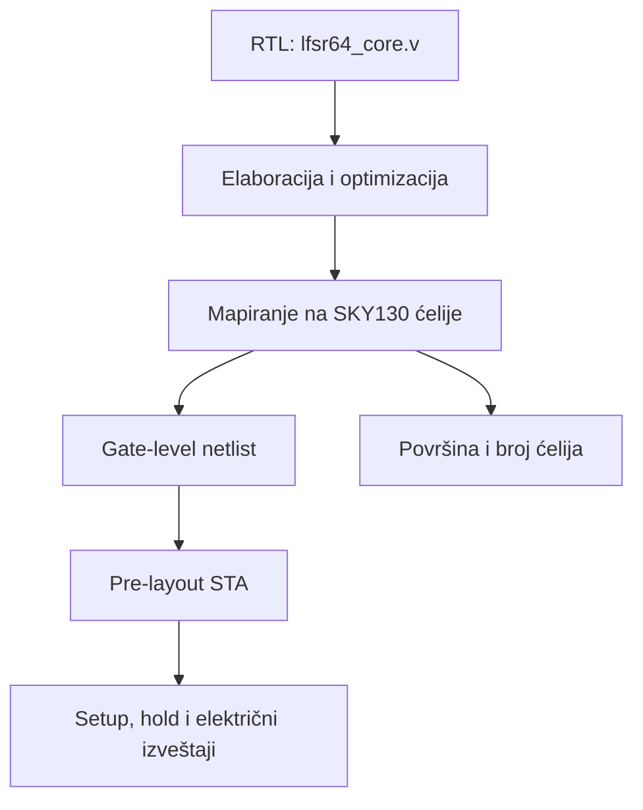

# Detaljan izveštaj o RTL sintezi modula `lfsr64_core`

**Projekat:** poređenje hardverskih implementacija PRNG algoritama  
**Modul:** `lfsr64_core`  
**Tehnologija:** SkyWater SKY130  
**Alat i tok:** LibreLane 2.4.2, `SynthesisExploration`  
**Radna frekvencija u eksperimentu:** 50 MHz (`CLOCK_PERIOD = 20 ns`)  
**Datum dokumentovanja:** 25. avgust 2026.

---

## 1. Svrha dokumenta

Ovaj dokument beleži kompletan postupak koji je sproveden za RTL sintezu modula `lfsr64_core`: pripremu i zamrzavanje izvornog koda, konfiguraciju alata, pokretanje sinteze, izbor rezultata za dalje poređenje, tumačenje površine i tajminga, ograničenja dobijenih procena i zaključke koji se odnose na sam LFSR64 algoritam.

Dokument ima tri praktične namene:

1. omogućava da se eksperiment ponovi pod istim uslovima;
2. predstavlja osnovu za poglavlje diplomskog rada o RTL sintezi;
3. definiše referentni postupak koji treba ponoviti za `xoroshiro64ss_core` i `pcg32_oneseq_core`.

Najvažnije je da se rezultati sva tri jezgra kasnije porede pod **istim PDK-om, standard-cell bibliotekom, periodom takta, ograničenjima i strategijom sinteze**. U suprotnom razlike ne bi poticale samo od algoritama.

---

## 2. Kratak zaključak unapred

RTL modul `lfsr64_core` uspešno je preveden iz Verilog opisa u mrežu standardnih ćelija biblioteke `sky130_fd_sc_hd`. Za zajedničku uporednu osnovu sačuvan je rezultat strategije `AREA 0`.

Glavni rezultat za `AREA 0` je:

| Veličina | Rezultat |
|---|---:|
| Standardne ćelije | 381 |
| Procena ukupne površine ćelija | 5058.6016 µm² |
| Sekvencijalne ćelije | 2828.9632 µm², odnosno 55.92% |
| Flip-flop ćelije | 133 |
| Memorije i latch-evi | 0 |
| Najgori setup slack | +9.9935 ns |
| Najgori hold slack | +0.0458 ns |
| Setup/hold TNS | 0 ns / 0 ns |
| Setup/hold prekršaji | 0 / 0 |
| Max-capacitance prekršaji | 2 |
| Max-slew prekršaji | 347 |
| Max-fanout prekršaji | 6 |

Pozitivni setup i hold slack i nulti TNS znače da dizajn zadovoljava korišćena vremenska ograničenja na 50 MHz u ovoj **pre-layout** analizi. Međutim, veliki broj slew prekršaja, idealna mreža takta, generički SDC i odsustvo realnih parazita znače da rezultat nije signoff rezultat i da još ne opisuje konačan fizički čip.

Za algoritam se vidi da je logika relativno jednostavna i plitka, dok registre otpada više od polovine površine. Jezgro generiše jedan 32-bitni rezultat na svakih 32 takta, pa na 50 MHz teorijski daje najviše 1.5625 miliona reči u sekundi, odnosno 50 Mbit/s sirovog izlaznog toka.

---

## 3. Šta je RTL sinteza

RTL sinteza je postupak kojim alat pretvara opis ponašanja digitalnog kola u Verilogu u konkretno povezanu mrežu ćelija iz izabrane tehnološke biblioteke.

U ovom slučaju postupak izgleda ovako:



Sinteza odgovara na pitanja kao što su:

- da li je RTL sintetizabilan;
- koliko i kojih standardnih ćelija je potrebno;
- kolika je zbirna površina tih ćelija;
- da li mapirana mreža, prema modelima biblioteke i zadatim ograničenjima, može da radi na ciljnom periodu takta;
- koji logički putevi imaju najmanju vremensku rezervu.

Sama sinteza još ne radi konačno fizičko raspoređivanje ćelija, rutiranje veza, izgradnju mreže takta i ekstrakciju realnih parazita. Zato njeni rezultati predstavljaju **ranu, ali veoma korisnu procenu**, a ne finalni GDS/signoff rezultat.

---

## 4. Algoritam i arhitektura modula

### 4.1. LFSR koji se implementira

Modul koristi 64-bitni Galois LFSR koji se pomera udesno. Serijski izlazni bit je stari `state[0]`, a povratna maska je:

```text
64'hD800_0000_0000_0000
```

RTL komentar ovu realizaciju povezuje sa polinomom u usvojenoj right-shift Galois/tap-mask konvenciji:

```text
x^64 + x^63 + x^61 + x^60 + 1
```

U konvenciji karakterističnog polinoma tranzicione matrice isti smerno-konvencijski par može se recipročno zapisati kao `x^64 + x^4 + x^3 + x + 1`. Navođenje konvencije je važno jer oba zapisa mogu da se sretnu u literaturi za isti generator.

Jedan elementarni korak je:

```text
next_state = (current_state >> 1)
             XOR (LFSR_MASK ako je current_state[0] = 1)
```

Za korišćeni primitivni polinom, svaki nenulti početni state pripada sekvenci perioda `2^64 - 1`. Stanje nula je zabranjeno jer bi LFSR iz njega zauvek generisao nule. RTL namerno ne popravlja takvo stanje, već koristi nenulti reset seed:

```text
RESET_STATE = 64'h0123_4567_89AB_CDEF
```

LFSR je linearan i deterministički generator. Dobar period i prolazak osnovnih statističkih testova ne znače da je kriptografski bezbedan: iz dovoljno izlaznih bitova linearni LFSR može da se rekonstruiše i predvidi.

### 4.2. Formiranje 32-bitne reči

Jedan prihvaćen zahtev pokreće 32 uzastopna LFSR koraka. Izlazni bit svakog koraka uzima se iz starog `state[0]`, a prvi generisani bit postavlja se u bit 0 izlazne reči. To je LSB-first konvencija usklađena sa Python referentnim modelom.

Za podrazumevano reset stanje prvi očekivani rezultat je:

```text
random_o = 32'h89AB_CDEF
```

a stanje posle tih 32 elementarna koraka je:

```text
next_state = 64'hD4D1_EE7B_9123_4567
```

Ovaj primer je bit-exact kontrolni vektor, a ne rezultat same sinteze.

### 4.3. Interfejs

Modul ima šest RTL portova sa ukupno 37 bitova:

| Port | Smer | Širina | Uloga |
|---|---|---:|---|
| `clk_i` | ulaz | 1 | takt |
| `rst_ni` | ulaz | 1 | sinhroni, aktivno-niski reset sekvencijalnog stanja |
| `next_i` | ulaz | 1 | zahtev za novom reči |
| `ready_o` | izlaz | 1 | jezgro može da primi zahtev |
| `random_o` | izlaz | 32 | generisana reč |
| `valid_o` | izlaz | 1 | jednoperiodni impuls kada je nova reč završena |

Zahtev se prihvata samo kada važi `next_i && ready_o`. Dok je jezgro zauzeto, novi zahtevi se ignorišu i ne stavljaju se u red.

### 4.4. Latencija i protok

Prvi LFSR korak obavlja se već na ivici prihvatanja zahteva. Zatim sledi još 31 zauzeta ivica. U testovima se to naziva latencijom od 32 ciklusa jer se broje 32 rastuće ivice, sa prihvatnom ivicom kao korakom 1 i završnom ivicom kao korakom 32. Završna ivica je vremenski 31 pun period posle prihvatne ivice. Sledeći zahtev može da bude prihvaćen na narednoj ivici, pa su pri stalno aktivnom `next_i` uzastopni `valid_o` impulsi razmaknuti 32 perioda.

Za 50 MHz:

```text
period takta       = 20 ns
vreme po reči      = 32 × 20 ns = 640 ns
reči u sekundi     = 50 000 000 / 32 = 1 562 500 reči/s
izlazni bit-rate   = 1 562 500 × 32 = 50 000 000 bit/s
```

Ovo je idealni protok samog jezgra uz kontinuirane legalne zahteve. Ne uključuje kašnjenje spoljnog sistema, pakovanje u Tiny Tapeout wrapper ili komunikaciju sa čipom.

---

## 5. Funkcionalna verifikacija pre sinteze

Pre zamrzavanja RTL-a provereno je da se ponašanje Verilog modula poklapa sa Python referentnim modelom. Cocotb testovi obuhvatili su:

- prvu reč i tačnu latenciju od 32 takta;
- 1000 uzastopnih reči u poređenju sa Python modelom;
- mirovanje i zadržavanje poslednjeg izlaza;
- kontinuirane zahteve i jednu reč na svaka 32 takta;
- reset i ponovno pokretanje iste sekvence;
- ignorisanje zahteva dok je jezgro zauzeto;
- prekid nedovršene reči resetom.

Ranije su urađeni i osnovni statistički testovi izlaznih sekvenci, uključujući monobit, runs, autokorelaciju i hi-kvadrat proveru raspodele bajtova.

Važno ograničenje: uspešna sinteza ne dokazuje funkcionalnu ispravnost, a statistički testovi ne dokazuju kriptografsku bezbednost. Funkcija se proverava testovima i referentnim modelom; sinteza proverava implementabilnost i daje tehnološke procene.

Nije tvrđeno da je u ovoj fazi urađena formalna ekvivalencija RTL-a i sintetizovanog netlista niti kompletna gate-level simulacija sa kašnjenjima.

---

## 6. Zamrzavanje ulaznog RTL-a

Da se rezultati kasnije mogu vezati za tačno određenu verziju koda, verifikovana osnova je sačuvana u Git istoriji:

| Stavka | Vrednost |
|---|---|
| Commit | `edbc39c` |
| Poruka | `Freeze verified PRNG core baseline v1` |
| Tag | `prng-core-baseline-v1` |

Time su zajedno zamrznuti Python modeli, RTL jezgra, Cocotb testovi i statistički rezultati. Za proveru da se LFSR RTL nije promenio u odnosu na tu osnovu korišćen je princip:

```bash
git diff --quiet prng-core-baseline-v1 -- src/lfsr64_core.v \
  && echo "RTL baseline OK" \
  || echo "STOP: RTL je promenjen"
```

Dobijeno je `RTL baseline OK`.

Ovaj korak je važan zato što se svaka brojka u izveštaju odnosi na konkretan RTL. Ako se izvor promeni, sinteza mora ponovo da se pokrene i rezultat mora dobiti novu verziju ili tag.

---

## 7. Organizacija fajlova

Za sintezu je napravljena sledeća struktura:

```text
synthesis/
├── .gitignore
├── lfsr64_core/
│   ├── config.json
│   └── runs/                  # sirovi izlaz alata; Git ga ignoriše
└── results/
    └── lfsr64_core/           # sačuvani, kurirani rezultati AREA 0
```

U `synthesis/.gitignore` nalazi se:

```gitignore
*/runs/
```

Razlog je što LibreLane u `runs/` proizvodi veliki broj privremenih i generisanih fajlova. Umesto čuvanja celog radnog direktorijuma u Git-u, izdvojeni su samo rezultati potrebni za reprodukciju, proveru i pisanje rada.

---

## 8. Konfiguracija sinteze

Fajl `synthesis/lfsr64_core/config.json` sadrži:

```json
{
  "DESIGN_NAME": "lfsr64_core",
  "VERILOG_FILES": [
    "dir::../../src/lfsr64_core.v"
  ],
  "CLOCK_PORT": "clk_i",
  "CLOCK_PERIOD": 20.0,
  "PDK": "sky130A",
  "STD_CELL_LIBRARY": "sky130_fd_sc_hd",
  "SYNTH_STRATEGY": "AREA 0"
}
```

### 8.1. Značenje polja

| Polje | Značenje |
|---|---|
| `DESIGN_NAME` | top-level Verilog modul koji se sintetizuje |
| `VERILOG_FILES` | RTL ulaz; putanja se računa u odnosu na lokaciju konfiguracije |
| `CLOCK_PORT` | signal koji alat tretira kao takt |
| `CLOCK_PERIOD` | ciljni period od 20 ns, odnosno 50 MHz |
| `PDK` | SkyWater 130 nm open-source procesni paket |
| `STD_CELL_LIBRARY` | high-density standard-cell biblioteka |
| `SYNTH_STRATEGY` | osnovna Yosys/ABC strategija optimizovana ka površini |

Konfiguracija je proverena komandom:

```bash
python -m json.tool synthesis/lfsr64_core/config.json
```

Uspešan formatirani ispis bez greške potvrdio je da je JSON sintaksno ispravan.

Konfiguracija je sačuvana u:

| Stavka | Vrednost |
|---|---|
| Commit | `dfb6da1` |
| Poruka | `Add LFSR64 core synthesis configuration` |

---

## 9. Provera okruženja

Pre pokretanja potvrđeno je:

| Provera | Rezultat |
|---|---|
| LibreLane verzija | 2.4.2 |
| `PDK_ROOT` | `/home/vscode/ttsetup/pdk` |
| `PDK` | `sky130A` |
| Open-PDKs snapshot | `0fe599b2afb6708d281543108caf8310912f54af` |
| Docker | radi (`Docker OK`) |
| Zamrznuti RTL | nepromenjen (`RTL baseline OK`) |

Prvobitna pomoćna komanda sa `rg` prijavila je `rg: command not found`. To nije bila greška u LibreLane-u niti u RTL-u, već samo nedostatak programa ripgrep u tom Codespace okruženju. Verzija LibreLane-a je zatim uspešno pročitana direktno iz Python paketa.

---

## 10. Pokretanje LibreLane toka

Korišćena je komanda:

```bash
python -m librelane --pdk-root "$PDK_ROOT" \
  --docker-no-tty \
  --dockerized \
  -j 1 \
  --flow SynthesisExploration \
  --run-tag lfsr64_core_50mhz \
  synthesis/lfsr64_core/config.json
```

### 10.1. Značenje opcija

| Opcija | Značenje |
|---|---|
| `--pdk-root "$PDK_ROOT"` | lokacija instaliranog PDK-a |
| `--dockerized` | koraci alata rade u kontrolisanom Docker okruženju |
| `--docker-no-tty` | bez interaktivnog terminala unutar kontejnera |
| `-j 1` | jedan paralelni posao, radi stabilnosti Codespace-a |
| `--flow SynthesisExploration` | isprobava više strategija sinteze |
| `--run-tag lfsr64_core_50mhz` | prepoznatljivo ime eksperimenta |
| `config.json` | konfiguracija konkretnog jezgra |

Tok je uspešno završen porukom `Flow complete`. Prikazano trajanje bilo je približno 42 sekunde u tadašnjem Codespace okruženju. To trajanje nije osobina hardverskog algoritma i ne koristi se kao metrika poređenja.

Tok je generisao zasebne SDC, synthesis i STA poddirektorijume za svaku istraženu strategiju i tri PVT ugla.

| Grupa direktorijuma | Sadržaj |
|---|---|
| `1-sdc-area-*` i `1-sdc-delay-*` | razrešena vremenska ograničenja za svaku strategiju |
| `1-synthesis-area-*` i `1-synthesis-delay-*` | mapirani netlist, statistika ćelija i površine |
| `1-sta-area-*` i `1-sta-delay-*` | multi-corner setup, hold, power i električni izveštaji |

Oznake početka i kraja Markdown blokova služe samo za formatiranje dokumenta i ne unose se u terminal; kopira se samo sadržaj komande između njih.

---

## 11. Rezultati `SynthesisExploration`

LibreLane je ispitao devet strategija:

| Strategija | Ćelije | Površina ćelija [µm²] | Najgori setup slack [ns] | Setup TNS [ns] |
|---|---:|---:|---:|---:|
| `AREA 0` | 381 | 5058.6016 | 9.9934907622 | 0.0 |
| `AREA 1` | 380 | 5052.3456 | 9.8835076254 | 0.0 |
| `AREA 2` | 382 | 5069.8624 | 9.9539783677 | 0.0 |
| `AREA 3` | 538 | 5814.3264 | 8.6426726000 | 0.0 |
| `DELAY 0` | 422 | 5717.9840 | 8.3531157688 | 0.0 |
| `DELAY 1` | 368 | 5098.6400 | 9.3664589846 | 0.0 |
| `DELAY 2` | 437 | 5639.1584 | 8.4849312200 | 0.0 |
| `DELAY 3` | 422 | 5717.9840 | 8.3531157688 | 0.0 |
| `DELAY 4` | 584 | 6592.5728 | 9.2277548214 | 0.0 |

### 11.1. Šta znače kolone

- **Ćelije** predstavlja broj instanci mapiranih standardnih ćelija. To nije broj tranzistora i nije nužno broj prostih logičkih vrata.
- **Površina** je zbir površina izabranih ćelija iz biblioteke. To nije konačna površina fizičkog bloka, jer ne uključuje konačan placement, routing, whitespace, tap/filler ćelije, clock tree i kasnije ubačene bafere.
- **Najgori setup slack** je najmanja vremenska rezerva među analiziranim setup putevima. Pozitivna vrednost znači da taj put zadovoljava zadato ograničenje.
- **TNS** je zbir svih negativnih slack vrednosti. Nula znači da nema setup puteva sa negativnim slack-om.

Broj ćelija sam po sebi nije dovoljan za procenu površine. Na primer, `DELAY 1` koristi manje ćelija od `AREA 0`, ali veću površinu, zato što ćelije mogu imati različite funkcije i pogonske jačine.

### 11.2. Zašto je izabran `AREA 0`

`AREA 1` je u ovom konkretnom pokretanju dao površinu manju za samo 6.2560 µm², odnosno približno 0.12%, i jednu ćeliju manje. Ipak, glavni rezultat je ostao `AREA 0` zato što je ta strategija unapred definisana kao zajednički baseline.

Biranje najbolje strategije posebno za svaki PRNG nakon gledanja rezultata uvelo bi metodološku pristrasnost. Zato važi pravilo:

> Glavno poređenje LFSR64, xoroshiro64** i PCG32 radi se sa istom strategijom `AREA 0`. Rezultati ostalih strategija mogu se prikazati samo kao dodatna exploration analiza.

---

## 12. Detaljna statistika netlista za `AREA 0`

Iz `reports/stat.rpt` dobijeno je:

| Stavka | Vrednost |
|---|---:|
| Wires | 353 |
| Wire bits | 384 |
| Public wires | 106 |
| Public wire bits | 137 |
| Ports | 6 |
| Port bits | 37 |
| Memories | 0 |
| Memory bits | 0 |
| Processes | 0 |
| Standard-cell instances | 381 |
| Flip-flop instances | 133 |
| Kombinacione ćelije | 248 |
| Ukupna površina ćelija | 5058.6016 µm² |
| Površina sekvencijalnih ćelija | 2828.9632 µm², 55.92% |
| Površina kombinacionih ćelija | 2229.6384 µm², 44.08% |

Ukupna zbirna površina ćelija može se zapisati i kao:

```text
5058.6016 µm² = 0.0050586016 mm²
```

To nije površina konačnog makroa ili die-a.

### 12.1. Tumačenje osnovnih brojeva

- `6 ports` i `37 port bits` odgovaraju stvarnom interfejsu modula.
- `0 memories` znači da nije inferovana SRAM/ROM memorija.
- `0 processes` ne znači da dizajn nema sekvencijalnu logiku. Znači da su RTL `always` procesi potpuno spušteni u mrežu ćelija.
- Nema latch-eva; stanje je implementirano edge-triggered flip-flopovima.
- 381 je broj instanci ćelija, ne broj logičkih jednačina niti tranzistora.
- Sekvencijalne ćelije zauzimaju 55.92% površine, pa skladištenje stanja i kontrolnih podataka dominira u ovom jezgru.

### 12.2. Zašto postoji 133, a ne 135 flip-flopova

Nominalna širina svih registara u RTL-u je:

| Registar | Bitovi |
|---|---:|
| `state_reg` | 64 |
| `partial_word_reg` | 32 |
| `steps_left_reg` | 5 |
| `busy_reg` | 1 |
| `random_o` | 32 |
| `valid_o` | 1 |
| **Ukupno u RTL zapisu** | **135** |

Sinteza je ipak zadržala 133 fizička flip-flopa. RTL struktura snažno objašnjava i konzistentna je sa sledeće dve optimizacije, bez potrebe da se pretpostavi gubitak funkcije:

1. `partial_word_reg[0]` se upisuje, ali se nikada ne čita pri formiranju izlaza, pa ga alat uklanja.
2. za podrazumevani `RESET_STATE`, `partial_word_reg[31]` i `state_reg[63]` imaju isto reset i update ponašanje: oba se resetuju na nulu i pri koraku dobijaju stari `state_reg[0]`. Alat zato može da deli jedan fizički flip-flop za oba logička signala.

Uklanjanje prvog i deljenje drugog logičkog bita objašnjavaju razliku između nominalnih 135 registarskih bitova i 133 fizička flip-flopa u ovom sintetizovanom parametarskom slučaju.

U izveštaju se pojavljuje ćelija:

```text
sky130_fd_sc_hd__dfxtp_2    133
```

Sufiks `_2` označava pogonsku jačinu varijante ćelije, a ne broj instanci. Broj instanci je poslednja vrednost, 133.

Sinhroni aktivno-niski reset implementiran je kombinacionom logikom na D putu običnih D flip-flopova. Zbog toga mapiranje ne mora da koristi flip-flopove sa posebnim asinhronim reset pinom.

---

## 13. Statička vremenska analiza

### 13.1. Šta je STA

Static Timing Analysis proverava vremenske puteve bez simuliranja konkretnih ulaznih vektora. Za svaki put računa vreme dolaska podatka i vreme do kog podatak mora da stigne.

```text
setup slack = required time - arrival time
```

Za hold proveru se takođe traži nenegativna rezerva između najranijeg dolaska podatka i minimalnog dozvoljenog vremena.

- slack > 0: uslov je zadovoljen;
- slack = 0: put je tačno na granici;
- slack < 0: postoji vremenski prekršaj.

### 13.2. Analizirani PVT uglovi

| Oznaka | Proces | Temperatura | Napon | Tipična uloga |
|---|---|---:|---:|---|
| `nom_ff_n40C_1v95` | fast-fast | -40 °C | 1.95 V | veoma brze ćelije; često nepovoljan hold |
| `nom_ss_100C_1v60` | slow-slow | 100 °C | 1.60 V | spore ćelije; često nepovoljan setup |
| `nom_tt_025C_1v80` | typical-typical | 25 °C | 1.80 V | nominalni ugao |

Prefiks `nom` se odnosi na korišćeni nominalni interconnect model u ovoj fazi.

### 13.3. Sažetak tajminga

| Ugao | Najgori setup slack (WS) [ns] | Najgori hold slack (WS) [ns] | Setup TNS [ns] | Hold TNS [ns] | Setup/hold prekršaji | Max-cap | Max-slew | Max-fanout |
|---|---:|---:|---:|---:|---:|---:|---:|---:|
| Overall | +9.9935 | +0.0458 | 0.0000 | 0.0000 | 0 / 0 | 2 | 347 | 6 |
| `nom_tt_025C_1v80` | +10.7809 | +0.2107 | 0.0000 | 0.0000 | 0 / 0 | 1 | 307 | 6 |
| `nom_ss_100C_1v60` | +9.9935 | +0.6981 | 0.0000 | 0.0000 | 0 / 0 | 2 | 347 | 6 |
| `nom_ff_n40C_1v95` | +11.0809 | +0.0458 | 0.0000 | 0.0000 | 0 / 0 | 1 | 98 | 6 |

LibreLane pozitivne vrednosti vodi kao `Worst Slack` (`WS`). Odvojena
negative-slack-only `WNS` polja iznose nula jer nema negativnih putanja.

Zaključak iz ove tabele je precizan:

- setup i hold zadovoljavaju korišćena ograničenja u sva tri ugla;
- ne postoji negativan setup ili hold slack;
- postoje električni max-capacitance i max-slew prekršaji koje kasniji fizički tok mora da reši.

---

## 14. Najgori setup put

Najgori setup rezultat za `AREA 0` javlja se u `nom_ss_100C_1v60` uglu:

```text
Startpoint: rst_ni   (input port clocked by clk_i)
Endpoint:   ready_o  (output port clocked by clk_i)
Path group: clk_i
Path type:  max
```

Logički put je veoma kratak:

```text
rst_ni -> sky130_fd_sc_hd__and2b_2 -> ready_o
```

To odgovara RTL izrazu:

```verilog
assign ready_o = rst_ni && !busy_reg;
```

Bitni brojevi iz izveštaja su:

| Deo | Vreme [ns] |
|---|---:|
| Ulazno eksterno kašnjenje | 4.000000 |
| Kašnjenje reset mreže/pina | približno 0.932605 |
| Kašnjenje AND ćelije | približno 0.823905 |
| Data arrival time | 5.756510 |
| Period takta | 20.000000 |
| Clock uncertainty | -0.250000 |
| Izlazno eksterno kašnjenje | -4.000000 |
| Data required time | 15.750001 |
| **Setup slack** | **+9.993491, MET** |

Provera računom:

```text
required ≈ 20.00 - 0.25 - 4.00 = 15.75 ns
slack    ≈ 15.750001 - 5.756510 = 9.993491 ns
```

### 14.1. Šta ovaj put znači, a šta ne znači

Ovaj put je I/O put od reset ulaza do `ready_o`; nije kritični put LFSR povratne logike i nije register-to-register put kroz 64-bitno stanje. Zato se iz vrednosti `20 ns - 9.9935 ns` ne sme automatski zaključiti da je maksimalna frekvencija jezgra približno 100 MHz.

U detaljnom `max.rpt` vide se i reset-to-register putevi oblika:

```text
rst_ni -> A21OI -> A22O -> AND2 -> DFF
```

Za prikazani put arrival je oko 9.235482 ns, required 19.618637 ns, a slack oko +10.383154 ns. I ti putevi zadovoljavaju 20 ns ograničenje.

Važan nalaz je visok fanout reset signala: za `rst_ni` je prikazan fanout 104, a za jedan izvedeni reset čvor fanout 97, uz slew oko 3.998 ns. To objašnjava veliki deo električnih upozorenja.

---

## 15. Najgori hold put

Najmanji hold slack pojavljuje se u brzom uglu `nom_ff_n40C_1v95`. Tipičan prikazani put je između susednih bitova stanja:

```text
state_reg[1] -> A21O -> sledeći state flip-flop
```

Slični putevi postoje za `state_reg[2]`, `state_reg[3]` i druge susedne bitove. To je očekivano za shift strukturu LFSR-a: put od jednog registra do sledećeg sadrži samo vrlo malo kombinacione logike.

Za najgori prikazani put:

| Deo | Vreme [ns] |
|---|---:|
| Clock-to-Q | 0.222022 |
| Jedna kombinaciona ćelija | 0.060398 |
| Data arrival time | 0.282420 |
| Clock uncertainty | 0.250000 |
| Library hold time | -0.013341 |
| Data required time | 0.236659 |
| **Hold slack** | **+0.045761, MET** |

Provera računom:

```text
slack = 0.282420 - 0.236659 = 0.045761 ns
      = 45.761 ps
```

Pozitivnih 45.761 ps znači da hold uslov prolazi, ali je ovo najmanja vremenska rezerva. Kratki shift putevi su prirodni kandidati za hold problem nakon fizičke realizacije, zbog čega se rezultat mora ponovo proveriti posle clock-tree synthesis i rutiranja.

---

## 16. Električni prekršaji: slew, fanout i capacitance

`area0_sta_state.json` prikazuje najviše 347 max-slew, 6 max-fanout i 2
max-capacitance prekršaja. To nisu setup ili hold prekršaji.

- **Max capacitance** znači da je efektivno opterećenje nekog izlaza iznad preporučene granice biblioteke.
- **Max slew** znači da je prelaz sporiji od zajedničkog implementacionog cilja
  od 0.75 ns. Taj stroži LibreLane/Open-PDKs cilj nije isto što i bibliotečka
  granica od 1.5 ns.

Najverovatniji glavni uzrok u ovom netlistu je reset mreža velikog fanout-a. U synthesis-only fazi nema fizičkog rasporeda ni kompletne buffer-tree optimizacije. Place-and-route tok obično umeće bafere, menja pogonske jačine ćelija i prilagođava mrežu stvarnim parazitima.

Zato je korektna formulacija:

> Dizajn je setup/hold čist za korišćenu pre-layout analizu na 50 MHz, ali nije električno niti fizički signoff-clean; slew, fanout i capacitance prekršaji moraju se ponovo analizirati i rešiti u P&R toku.

---

## 17. Ograničenja SDC-a i pre-layout modela

Tok je prijavio upozorenja da `PNR_SDC_FILE` i `SIGNOFF_SDC_FILE` nisu definisani, pa je korišćen generički fallback SDC. U tom SDC-u se u izveštajima vide, između ostalog:

- input external delay od 4 ns;
- output external delay od 4 ns;
- clock uncertainty od 0.25 ns.

To su upozorenja, ne greške, i tok se uspešno završio. Ipak, ona znače da vremenske rezultate treba vezati za generički model interfejsa, a ne predstavljati kao konačna sistemska ili signoff ograničenja.

Izveštaji takođe prikazuju:

```text
clock network delay (ideal) = 0
```

To znači da još ne postoji fizički izgrađena mreža takta. Posle CTS-a takt dobija realan insertion delay i skew, a posle rutiranja i ekstrakcije i realne RC parazite. Zbog toga se hold rezerva od 45.761 ps mora pažljivo ponovo proveriti u fizičkom toku.

---

## 18. Procena snage

Sačuvan je tipični `power.rpt` kao:

```text
area0_power_tt_preliminary.rpt
```

On je namerno označen kao **preliminary**. Nije obezbeđena reprezentativna VCD/SAIF aktivnost za stvarni rad jezgra, pa procena ne predstavlja pouzdanu realnu dinamičku snagu niti energiju po generisanoj reči.

Eksplicitni TT izveštaj za 25 °C, 1.80 V i 50 MHz prijavljuje
0.3076771 mW internal, 0.02038748 mW switching i 2.014717 nW leakage snage,
odnosno ukupno 0.3280666 mW. To je preliminarna vectorless procena, a ne
activity-aware energija po reči.

Za korektno kasnije poređenje potrebno je:

1. definisati isti radni scenario za sva tri PRNG jezgra;
2. generisati switching activity za isti broj izlaznih reči i isti obrazac zahteva;
3. koristiti isti napon, ugao, frekvenciju i fizičku fazu;
4. odvojeno prikazati leakage, internal i switching power;
5. izračunati energiju po 32-bitnoj reči, jer jezgra mogu imati različitu latenciju i throughput.

Trenutni power izveštaj može da posluži za trag reprodukcije, ali ne treba koristiti kao konačnu brojku u zaključku rada.

---

## 19. Šta rezultati znače za LFSR64 algoritam

### 19.1. Hardverska jednostavnost

LFSR koristi pomeranje, izbor povratne maske i XOR logiku, bez sabirača, množača ili širokih rotacija. Rezultati potvrđuju da je kombinacioni deo relativno plitak.

Ipak, ovo konkretno jezgro ne sadrži samo minimalni 64-bitni LFSR. Ono ima transakcioni 32-bitni interfejs, registar za sklapanje reči, izlazni registar i kontrolne registre. Zato je dobijena površina svojstvo **algoritma zajedno sa izabranom mikroarhitekturom i interfejsom**.

### 19.2. Registri dominiraju površinom

Sekvencijalne ćelije zauzimaju 55.92% ukupne površine ćelija. To pokazuje da najveći deo cene ne dolazi od složene povratne funkcije, već od čuvanja:

- 64-bitnog LFSR stanja;
- delimično sklopljene 32-bitne reči;
- poslednjeg 32-bitnog izlaza;
- brojača i handshake stanja.

Ovo je važan zaključak za optimizaciju: smanjenje samo XOR logike možda neće značajno smanjiti ukupnu površinu dok god interfejs zahteva iste registre.

### 19.3. Timing na 50 MHz nije ograničavajući u sintezi

Setup rezerva je velika, a kritični prijavljeni setup put je reset-to-ready I/O put, ne duboka LFSR logika. To je u skladu sa očekivanjem da je jedan elementarni Galois LFSR korak logički jednostavan.

Ipak, nije određena stvarna maksimalna frekvencija. Za to bi trebalo:

- koristiti odgovarajuće I/O i clock constraints;
- uraditi sweep kraćih perioda ili eksplicitno tražiti register-to-register kritični put;
- završiti fizičku implementaciju i post-route STA;
- proveriti sve PVT uglove i signoff pravila.

### 19.4. Throughput je ograničen serijalnim formiranjem reči

Jezgro radi jedan LFSR korak po taktu i troši 32 takta po 32-bitnoj reči. Time se štedi kombinaciona logika u odnosu na potpuno unrolled 32-step implementaciju, ali se smanjuje broj reči u sekundi.

Zato se algoritmi ne smeju porediti samo po frekvenciji. Za diplomski rad treba prikazati najmanje:

- površinu;
- latenciju u taktovima;
- maksimalni održivi broj reči u sekundi;
- bit/s po mm² ili reči/s po mm²;
- kasnije, energiju po reči.

### 19.5. Kvalitet slučajnosti je odvojena osa poređenja

LFSR je veoma efikasan za hardver, test-pattern generation, scrambling i slične namene, ali je linearan i predvidiv. Fiksni reset seed uvek vraća istu izlaznu sekvencu. Osnovni statistički testovi mogu biti uspešni iako generator nije pogodan za kriptografiju.

Jezgro između dve 32-bitne reči pomera stanje za 32 elementarna koraka. Pošto je `gcd(32, 2^64 - 1) = 1`, posmatranje stanja samo na granicama reči ne skraćuje ciklus: za nenulti seed word-to-word stanje i dalje prolazi kroz puni period od `2^64 - 1` reči. To je osobina perioda stanja; ne menja zaključak o linearnoj predvidivosti generatora.

Zato konačno poređenje mora razdvojiti:

1. funkcionalnu i statističku ispravnost izlazne sekvence;
2. hardversku cenu i performanse;
3. bezbednosna i kvalitativna ograničenja algoritma.

---

## 20. Šta se sme, a šta ne sme zaključiti

### 20.1. Potkrepljeni zaključci

- RTL je sintetizabilan u LibreLane 2.4.2 za `sky130A` i `sky130_fd_sc_hd`.
- `AREA 0` mapiranje koristi 381 standardnu ćeliju i zbirno 5058.6016 µm² cell area.
- U mapiranom netlistu postoji 133 flip-flopa i 248 kombinacionih ćelija.
- Nema inferovanih memorija ni latch-eva.
- Sva analizirana setup i hold ograničenja prolaze na 20 ns u pre-layout STA.
- Najmanji hold slack je +45.761 ps i zahteva pažnju posle CTS/routinga.
- Reset mreža velikog fanout-a dominantno utiče na prikazane slew/capacitance probleme.
- Za jednu reč potrebno je 32 takta; na 50 MHz idealni maksimum je 1.5625 Mword/s.

### 20.2. Zaključci koji još nisu opravdani

- da je konačna fizička površina tačno 5058.6016 µm²;
- da dizajn pouzdano radi na približno 100 MHz samo na osnovu setup slack-a;
- da je dizajn signoff-clean;
- da će hold ostati pozitivan posle CTS-a i rutiranja;
- da je trenutna power brojka realna ili pogodna za konačno poređenje;
- da sinteza sama dokazuje funkcionalnu ekvivalenciju;
- da prolazak osnovnih statističkih testova znači kriptografsku sigurnost.

---

## 21. Sačuvani artefakti

Iz velikog `runs/` stabla izdvojeno je 13 fajlova u `synthesis/results/lfsr64_core/`:

| Fajl | Svrha |
|---|---|
| `README.md` | objašnjenje paketa rezultata |
| `resolved_config.json` | efektivna LibreLane konfiguracija posle razrešavanja podrazumevanih vrednosti |
| `exploration_summary.rpt` | poređenje svih AREA i DELAY strategija |
| `area0_netlist.v` | sintetizovani gate-level netlist za `AREA 0` |
| `area0_stat.rpt` | čitljiv izveštaj o ćelijama i površini |
| `area0_stat.json` | mašinski čitljiva statistika |
| `area0_synthesis_state.json` | stanje koraka sinteze |
| `area0_sta_summary.rpt` | sažetak setup, hold i električnih provera |
| `area0_sta_state.json` | stanje STA koraka |
| `area0_setup_ss_max.rpt` | detaljan setup izveštaj u SS uglu |
| `area0_hold_ff_min.rpt` | detaljan hold izveštaj u FF uglu |
| `area0_ss_violators.rpt` | sačuvano zaglavlje SS violator izveštaja; pojedinačne tačke nisu izlistane, pa se zbirni brojevi uzimaju iz `area0_sta_state.json` i `area0_sta_summary.rpt` |
| `area0_power_tt_preliminary.rpt` | preliminarna power procena u TT uglu |

Najveći sačuvani fajlovi su približno 392 KiB za setup izveštaj, 352 KiB za hold izveštaj i 48 KiB za netlist. U Git commit-u je zbog detaljnih tekstualnih izveštaja prikazano 14 299 dodatih redova; to nije količina ručno napisanog izvornog koda.

Rezultati su zamrznuti u:

| Stavka | Vrednost |
|---|---|
| Commit | `058f8ce` |
| Poruka | `Preserve LFSR64 AREA 0 synthesis results` |
| Tag | `lfsr64-synthesis-area0-v1` |

Commit i tag uspešno su poslati na udaljeni GitHub repozitorijum. Završni `git status --short` bio je prazan, što potvrđuje da posle tog koraka nije bilo nesačuvanih promena.

---

## 22. Reprodukcija eksperimenta

Minimalna kontrolna lista je:

```bash
# 1. Provera RTL baseline-a
git diff --quiet prng-core-baseline-v1 -- src/lfsr64_core.v \
  && echo "RTL baseline OK" \
  || echo "STOP: RTL je promenjen"

# 2. Provera JSON-a
python -m json.tool synthesis/lfsr64_core/config.json

# 3. Provera verzije i okruženja
python -c "from importlib.metadata import version; print(version('librelane'))"
echo "PDK_ROOT=$PDK_ROOT"
echo "PDK=$PDK"
docker info >/dev/null && echo "Docker OK"

# 4. Pokretanje exploration toka
python -m librelane --pdk-root "$PDK_ROOT" \
  --docker-no-tty --dockerized -j 1 \
  --flow SynthesisExploration \
  --run-tag lfsr64_core_50mhz \
  synthesis/lfsr64_core/config.json
```

Za potpuno ponavljanje treba koristiti istu verziju LibreLane-a, isti PDK snapshot i istu verziju standard-cell biblioteke, ne samo isto ime PDK-a.

---

## 23. Veza sa završenim zajedničkim poređenjem

Isti postupak završen je i za `xoroshiro64ss_core` i
`pcg32_oneseq_core`. Konačni rezultati objedinjeni su u dokumentu
`lfsr64_vs_xoroshiro64ss_vs_pcg32_zavrsno_poredjenje_rtl_sinteze.md`.

| Jezgro | AREA 0 ćelije | Cell area [µm²] | Sekvencijalni udeo | Setup WS [ns] | Hold WS [ns] | Latencija [ciklusi] | Reči/s @ 50 MHz |
|---|---:|---:|---:|---:|---:|---:|---:|
| `lfsr64_core` | 381 | 5 058.6016 | 55.92% | +9.993491 | +0.045761 | 32 | 1 562 500 |
| `xoroshiro64ss_core` | 1 987 | 22 142.4864 | 9.32% | +1.949115 | +0.097219 | 1 | 50 000 000 |
| `pcg32_oneseq_core` | 5 998 | 64 853.4496 | 3.18% | +0.571877 | +0.142826 | 1 | 50 000 000 |

---

## 24. Formulacija pogodna za diplomski rad

> RTL sinteza 64-bitnog Galois LFSR jezgra izvršena je alatom LibreLane 2.4.2 za SkyWater 130 nm tehnologiju i biblioteku `sky130_fd_sc_hd`, uz ciljni period takta od 20 ns. U cilju metodološki doslednog poređenja sa ostalim PRNG jezgrima usvojena je strategija `AREA 0`. Sintetizovani netlist sadrži 381 standardnu ćeliju, od kojih su 133 flip-flopovi, dok procenjena zbirna površina ćelija iznosi 5058.6016 µm². Sekvencijalne ćelije zauzimaju 55.92% površine, što pokazuje da kod ove mikroarhitekture registri za stanje, sklapanje i čuvanje izlazne reči predstavljaju veći deo hardverske cene od same povratne XOR logike. Pre-layout statička vremenska analiza pokazala je pozitivan najgori setup slack od 9.9935 ns i pozitivan najgori hold slack od 0.0458 ns, bez setup i hold prekršaja. Istovremeno su zabeleženi slew i capacitance prekršaji, uglavnom povezani sa reset mrežom velikog fanout-a, pa rezultat ne predstavlja fizički signoff. Jezgro generiše jednu 32-bitnu reč za 32 takta, što pri 50 MHz odgovara idealnom protoku od 1.5625 miliona reči u sekundi. Dobijeni rezultat potvrđuje hardversku jednostavnost LFSR pristupa, ali i pokazuje da se konačno poređenje mora zasnivati istovremeno na površini, latenciji, protoku, post-route tajmingu i energiji po reči.

---

## 25. Konačni status

Sinteza `lfsr64_core` je uspešno završena, relevantni `AREA 0` artefakti su izdvojeni, dokumentovani, commit-ovani, tagovani i poslati na GitHub. Rezultat je dovoljno stabilan kao **synthesis baseline** za nastavak rada.

RTL synthesis faza za sva tri jezgra je zatvorena; sledeći tehnički korak je
jednak full-PnR tok za sva tri `AREA 0` baseline-a.
