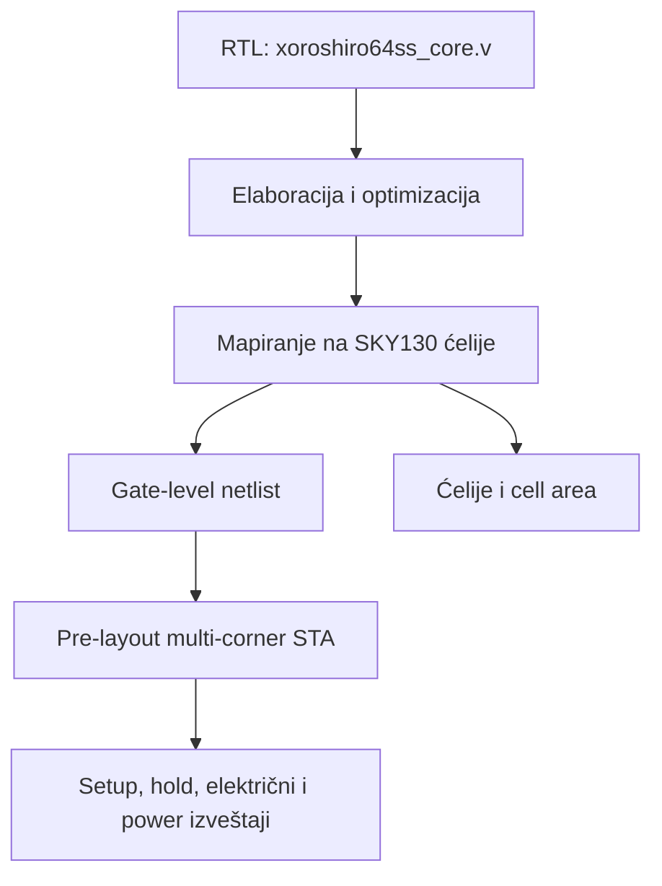
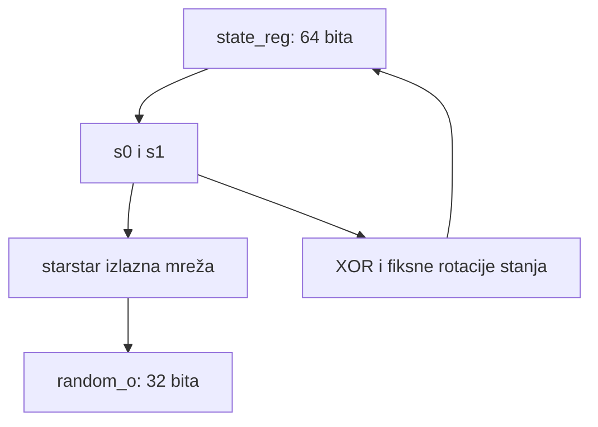

# Detaljan izveštaj o RTL sintezi modula `xoroshiro64ss_core`

**Projekat:** poređenje hardverskih implementacija PRNG algoritama  
**Modul:** `xoroshiro64ss_core`  
**Algoritam:** xoroshiro64** 1.0  
**Tehnologija:** SkyWater SKY130  
**Alat i tok:** LibreLane 2.4.2, `SynthesisExploration`  
**Radna frekvencija u eksperimentu:** 50 MHz (`CLOCK_PERIOD = 20 ns`)  
**Datum dokumentovanja:** 25. avgust 2026.

---

## 1. Svrha dokumenta

Ovaj dokument beleži kompletan postupak sproveden za RTL sintezu modula `xoroshiro64ss_core`: pripremu i zamrzavanje izvornog koda, konfiguraciju alata, pokretanje sinteze, poređenje strategija, izbor rezultata za zajednički baseline, tumačenje površine, tajminga i preliminarne snage, ograničenja pre-layout procena i zaključke koji se odnose na xoroshiro64** algoritam i izabranu jedno-ciklusnu mikroarhitekturu.

Dokument prati isti redosled i metodologiju kao detaljan izveštaj za `lfsr64_core`. Ima četiri praktične namene:

1. omogućava ponavljanje eksperimenta pod istim uslovima;
2. predstavlja osnovu za poglavlje diplomskog rada o RTL sintezi;
3. omogućava pošteno poređenje sa rezultatima `lfsr64_core` i `pcg32_oneseq_core`;
4. beleži xoroshiro-specifične nalaze koji kod LFSR-a nisu postojali: dubok unutrašnji kritični put, hardversku cenu `**` scramblera, strategije koje ne prolaze 50 MHz i detaljnu vectorless power procenu.

Za poređenje je presudno da sva jezgra koriste isti PDK, istu standard-cell biblioteku, isti takt, ista generička I/O ograničenja, iste PVT uglove i istu glavnu strategiju `AREA 0`. U suprotnom bi deo razlika poticao od uslova eksperimenta, a ne od algoritma i mikroarhitekture.

---

## 2. Kratak zaključak unapred

RTL modul `xoroshiro64ss_core` uspešno je preveden u mrežu standardnih ćelija biblioteke `sky130_fd_sc_hd`. Za zajedničko poređenje sačuvan je rezultat strategije `AREA 0`.

Glavni rezultat je:

| Veličina | Rezultat |
|---|---:|
| Standardne ćelije | 1987 |
| Procena ukupne površine ćelija | 22142.4864 µm² |
| Sekvencijalne ćelije | 2063.2288 µm², odnosno 9.32% |
| Kombinacione ćelije | 20079.2576 µm², odnosno 90.68% |
| Flip-flop ćelije | 97 |
| Memorije i latch-evi | 0 |
| Najgori setup slack | +1.949115 ns |
| Najgori hold slack | +0.097219 ns |
| Setup/hold TNS | 0 ns / 0 ns |
| Setup/hold prekršaji | 0 / 0 |
| Max-capacitance prekršaji | 1 |
| Max-slew prekršaji | 441 |
| Max-fanout prekršaji | 33 |
| Preliminarna TT ukupna snaga | 44.34212 mW |

Pozitivan setup i hold slack i nulti TNS znače da `AREA 0` zadovoljava korišćena vremenska ograničenja na 50 MHz u pre-layout STA. Dve strategije sa manjom zbirnom cell area, `AREA 1` i `AREA 2`, imaju negativan setup slack i zato nisu prihvatljive za glavni 50 MHz rezultat. `AREA 0` je istovremeno unapred dogovoreni baseline i rezultat sa najmanjom cell area među strategijama iz ovog pokretanja koje prolaze zadati tajming.

Za razliku od LFSR64 jezgra, ovde je najgori setup put pravi unutrašnji register-to-register put kroz izlazni `starstar` scrambler. Prolazi kroz 31 kombinacionu ćeliju i završava u registru `random_o`. To pokazuje da je ograničavajući deo implementacije formiranje izlazne reči:

```text
s0
  -> množenje konstantom 0x9E3779BB
  -> fiksna rotacija ulevo za 5
  -> množenje sa 5, realizovano kao shift-and-add
  -> random_o registar
```

Jezgro generiše jednu novu 32-bitnu reč po taktu. Na 50 MHz to znači najviše 50 miliona reči u sekundi, odnosno 1.6 Gbit/s sirovog izlaznog toka. Ovaj protok je 32 puta veći od serijske LFSR64 mikroarhitekture, ali uz približno 4.38 puta veću cell area i znatno veću preliminarnu vectorless power procenu.

---

## 3. Šta je RTL sinteza

RTL sinteza pretvara opis ponašanja digitalnog kola u Verilogu u konkretno povezanu mrežu ćelija iz izabrane tehnološke biblioteke.

U ovom slučaju tok izgleda ovako:



Sinteza odgovara na pitanja:

- da li je RTL sintetizabilan;
- koliko i kojih standardnih ćelija je potrebno;
- kolika je zbirna površina mapiranih ćelija;
- da li mapirana mreža zadovoljava cilj od 20 ns prema modelima biblioteke;
- gde su najsporiji i najkraći vremenski putevi;
- koji ulazi i unutrašnji čvorovi imaju prevelik fanout, kapacitivnost ili slew.

Sinteza još ne radi konačan placement, routing, clock-tree synthesis, ekstrakciju realnih parazita ni signoff proveru. Zbog toga su dobijene brojke rane tehnološke procene, a ne karakteristike konačnog fizičkog čipa.

---

## 4. Algoritam i arhitektura modula

### 4.1. Xoroshiro64** 1.0

Generator ima 64-bitno stanje podeljeno na dve 32-bitne reči:

```text
state[63:32] = s0
state[31:0]  = s1
```

Izlaz se računa iz starog `s0`:

```text
product = s0 * 0x9E3779BB mod 2^32
output  = rotl32(product, 5) * 5 mod 2^32
```

Zatim se stanje ažurira:

```text
t      = s1 XOR s0
new_s0 = rotl32(s0, 26) XOR t XOR (t << 9)
new_s1 = rotl32(t, 13)
```

Operacije se izvršavaju modulo `2^32` tamo gde je rezultat 32-bitan. Staro stanje se koristi i za izlaz i za formiranje novog stanja; ne sme se prvo ažurirati stanje pa tek onda računati izlaz.

Za podrazumevani reset seed:

```text
RESET_STATE = 64'h0123_4567_89AB_CDEF
```

prvi bit-egzaktan kontrolni vektor je:

```text
random_o   = 32'h4F7C_C6BB
next_state = 64'h059D_159D_1111_1111
```

Ovaj vektor potiče iz referentnog modela i funkcionalne verifikacije; nije rezultat same sinteze.

### 4.2. Linearni state transition i nelinearni output scrambler

Rotacije i XOR operacije u prelazu stanja linearne su nad GF(2). Izlazna funkcija, međutim, sadrži množenja modulo `2^32` i zato izlaz nije prosta linearna funkcija stanja. Oznaka `**`, odnosno „starstar”, odnosi se upravo na ovaj scrambler.

Oba množitelja su neparna, pa su množenja bijektivna nad 32-bitnim rečima modulo `2^32`; fiksna rotacija je takođe bijektivna. Scrambler zato ne smanjuje broj mogućih `s0` vrednosti, ali menja način na koji se linearno stanje vidi na izlazu.

Za svako nenulto početno stanje xoroshiro64** ima period unutrašnjeg stanja `2^64 - 1`. Stanje nula je zabranjeno jer bi ostalo nula. RTL ga namerno ne popravlja automatski, već koristi nenulti reset seed.

Generator nije kriptografski bezbedan. Nelinearni scrambler poboljšava statističke osobine izlaza u odnosu na direktno izlaganje linearnog stanja, ali 64-bitno determinističko stanje i struktura algoritma nisu namenjeni odbrani od napadača koji pokušava da rekonstruiše stanje.

### 4.3. Hardverska organizacija



RTL koristi:

- jedan 64-bitni registar stanja;
- jedan 32-bitni izlazni registar;
- jedan `valid_o` flip-flop;
- kombinacionu mrežu za scrambler i sledeće stanje.

Fiksne rotacije se u hardveru najvećim delom svode na prevezivanje bitova. Glavna kombinaciona cena dolazi od konstantnog množenja, završnog sabiranja za množenje sa pet i široke XOR mreže.

Prvo množenje napisano je operatorom `*` sa konstantom `32'h9E37_79BB`. Sinteza ga je spustila u mrežu običnih standardnih ćelija; nije ostao poseban multiplier makro. Drugo množenje sa pet eksplicitno je zapisano kao:

```verilog
rotated_product + (rotated_product << 2)
```

čime je izbegnut drugi opšti RTL množitelj.

### 4.4. Interfejs

Modul ima šest portova sa ukupno 37 bitova:

| Port | Smer | Širina | Uloga |
|---|---|---:|---|
| `clk_i` | ulaz | 1 | takt |
| `rst_ni` | ulaz | 1 | sinhroni, aktivno-niski reset |
| `next_i` | ulaz | 1 | zahtev za sledećom reči |
| `ready_o` | izlaz | 1 | jezgro može da primi zahtev |
| `random_o` | izlaz | 32 | registrovana slučajna reč |
| `valid_o` | izlaz | 1 | označava da je izlazna reč proizvedena |

Važi:

```verilog
assign ready_o = rst_ni;
```

Zato je jezgro spremno u svakom ciklusu van reseta. Zahtev se prihvata kada važi `next_i && ready_o`.

### 4.5. Latencija i protok

Izlaz i novo stanje registruju se na prvoj rastućoj ivici na kojoj je zahtev prihvaćen. U usvojenoj Cocotb konvenciji latencija je jedan ciklus. Ako `next_i` ostane aktivan, `valid_o` može ostati visok kroz uzastopne cikluse i svaka ivica daje novu reč.

Na 50 MHz:

```text
period takta       = 20 ns
reči po taktu      = 1
reči u sekundi     = 50 000 000 reči/s
izlazni bit-rate   = 50 000 000 × 32
                   = 1 600 000 000 bit/s
```

To je idealan protok jezgra. Ne uključuje Tiny Tapeout wrapper, ograničenje broja fizičkih I/O pinova niti brzinu prenosa rezultata van čipa.

---

## 5. Funkcionalna verifikacija pre sinteze

Pre sinteze je provereno da se Verilog poklapa sa bit-egzaktnim Python modelom. Cocotb test `test_xoroshiro64ss_rtl.py` sadrži šest provera:

1. prva reč i tačna jedno-ciklusna latencija;
2. 1000 uzastopnih reči u poređenju sa Python modelom;
3. pauza bez zahteva, zadržavanje stanja i poslednjeg izlaza;
4. kontinuirano aktivan `next_i` i jedna reč po ciklusu za 64 reči;
5. pravilno ponašanje `valid_o` za nepravilan obrazac pojedinačnih zahteva;
6. reset i ponovno pokretanje originalne sekvence.

Python testovi dodatno proveravaju:

- prvih pet golden vektora;
- identičnost funkcionalnog i objektno-orijentisanog modela;
- učitavanje stanja i reset;
- granična nenulta stanja;
- odbijanje stanja nula i nevažećih tipova/vrednosti;
- nezavisnost dve instance generatora.

Zajednička statistička platforma koristila je isti 64-bitni seed, isti broj izlaznih reči i isti redosled bitova za sva jezgra. Za xoroshiro64** prošli su monobit, runs, autokorelacioni testovi za zadate lagove i hi-kvadrat provera raspodele bajtova.

Ove provere imaju različite uloge:

- Python i Cocotb proveravaju bit-egzaktnu funkciju i protokol;
- statistički testovi proveravaju odabrane osobine konačnog uzorka;
- sinteza proverava tehnološku implementabilnost i procenjuje cenu/tajming.

Uspešna sinteza sama ne dokazuje funkcionalnu ekvivalenciju, a prolazak osnovnih statističkih testova ne dokazuje kriptografsku bezbednost.

---

## 6. Zamrzavanje ulaznog RTL-a

Pre sinteze provereno je da je `src/xoroshiro64ss_core.v` identičan zamrznutoj projektnoj osnovi:

| Stavka | Vrednost |
|---|---|
| Baseline tag | `prng-core-baseline-v1` |
| Tag-object hash | `b7b493a` |
| Peeled RTL commit | `edbc39c` |
| Provera | `RTL baseline OK` |

Korišćene su komande:

```bash
git rev-parse --verify --short 'prng-core-baseline-v1^{commit}'

git diff --quiet 'prng-core-baseline-v1^{commit}' -- src/xoroshiro64ss_core.v \
  && echo "RTL baseline OK" \
  || echo "STOP: RTL je promenjen"
```

Anotirani tag-object ima hash `b7b493a`, dok je stvarni commit RTL sadržaja
`edbc39c`. Provera prema peeled commit-u nije pronašla razliku u RTL fajlu.

Ovaj korak vezuje svaku brojku iz izveštaja za konkretnu verziju koda. Promena RTL-a zahteva novu sintezu i novu verziju rezultata.

---

## 7. Organizacija fajlova

Korišćena je ista struktura kao za LFSR:

```text
synthesis/
├── .gitignore
├── xoroshiro64ss_core/
│   ├── config.json
│   └── runs/                  # kompletan sirovi izlaz alata
└── results/
    └── xoroshiro64ss_core/    # kurirani AREA 0 baseline
```

U `synthesis/.gitignore` nalazi se:

```gitignore
*/runs/
```

Kompletan `runs/` direktorijum nije commit-ovan jer sadrži veliki broj privremenih i ponovljivo generisanih fajlova. U Git je izdvojeno 13 artefakata potrebnih za proveru, poređenje i pisanje rada.

---

## 8. Konfiguracija sinteze

Fajl `synthesis/xoroshiro64ss_core/config.json` sadrži:

```json
{
  "DESIGN_NAME": "xoroshiro64ss_core",
  "VERILOG_FILES": [
    "dir::../../src/xoroshiro64ss_core.v"
  ],
  "CLOCK_PORT": "clk_i",
  "CLOCK_PERIOD": 20.0,
  "PDK": "sky130A",
  "STD_CELL_LIBRARY": "sky130_fd_sc_hd",
  "SYNTH_STRATEGY": "AREA 0"
}
```

### 8.1. Značenje polja

| Polje | Značenje |
|---|---|
| `DESIGN_NAME` | top-level modul koji se sintetizuje |
| `VERILOG_FILES` | ulazni RTL, relativan u odnosu na konfiguraciju |
| `CLOCK_PORT` | signal koji se tretira kao takt |
| `CLOCK_PERIOD` | ciljni period 20 ns, odnosno 50 MHz |
| `PDK` | SkyWater 130 nm procesni paket |
| `STD_CELL_LIBRARY` | high-density standard-cell biblioteka |
| `SYNTH_STRATEGY` | zajednički `AREA 0` baseline |

JSON sintaksa proverena je komandom:

```bash
python -m json.tool synthesis/xoroshiro64ss_core/config.json
```

Konfiguracija je sačuvana u:

| Stavka | Vrednost |
|---|---|
| Commit | `fe5ee6a` |
| Poruka | `Add xoroshiro64ss core synthesis configuration` |

---

## 9. Provera okruženja

Pre pokretanja potvrđeno je:

| Provera | Rezultat |
|---|---|
| LibreLane verzija | 2.4.2 |
| `PDK_ROOT` | `/home/vscode/ttsetup/pdk` |
| `PDK` | `sky130A` |
| Docker | radi (`Docker OK`) |
| Zamrznuti RTL | nepromenjen (`RTL baseline OK`) |

STA log dodatno beleži korišćeni SKY130 snapshot:

```text
0fe599b2afb6708d281543108caf8310912f54af
```

Ponavljanje sa istim imenom `sky130A`, ali drugim PDK snapshotom ili drugačijom verzijom biblioteke, može dati drugačije ćelije, površinu i tajming.

Pomoćne komande sa `rg` nisu radile jer ripgrep nije bio instaliran u Codespace-u. To nije problem RTL-a ili LibreLane-a. Za naknadne tekstualne provere korišćen je `grep`.

---

## 10. Pokretanje LibreLane toka

Korišćena je komanda:

```bash
python -m librelane --pdk-root "$PDK_ROOT" \
  --docker-no-tty \
  --dockerized \
  -j 1 \
  --flow SynthesisExploration \
  --run-tag xoroshiro64ss_core_50mhz \
  synthesis/xoroshiro64ss_core/config.json
```

### 10.1. Značenje opcija

| Opcija | Značenje |
|---|---|
| `--pdk-root "$PDK_ROOT"` | lokacija PDK-a |
| `--dockerized` | kontrolisano Docker okruženje |
| `--docker-no-tty` | bez interaktivnog TTY-a u kontejneru |
| `-j 1` | jedan paralelni posao, radi stabilnosti Codespace-a |
| `--flow SynthesisExploration` | isprobava AREA i DELAY strategije |
| `--run-tag xoroshiro64ss_core_50mhz` | naziv eksperimenta |
| `config.json` | konfiguracija konkretnog jezgra |

Tok se završio porukom `Flow complete`. Vreme izvršavanja zavisi od Codespace resursa i nije hardverska metrika.

Za devet strategija generisani su:

| Grupa direktorijuma | Sadržaj |
|---|---|
| `1-sdc-area-*` i `1-sdc-delay-*` | efektivna vremenska ograničenja |
| `1-synthesis-area-*` i `1-synthesis-delay-*` | netlist i statistika sinteze |
| `1-sta-area-*` i `1-sta-delay-*` | multi-corner STA i power izveštaji |

---

## 11. Rezultati `SynthesisExploration`

Dobijena je sledeća tabela:

| Strategija | Ćelije | Površina ćelija [µm²] | Najgori setup slack [ns] | Setup TNS [ns] |
|---|---:|---:|---:|---:|
| `AREA 0` | 1987 | 22142.4864 | +1.9491147026 | 0.0000000000 |
| `AREA 1` | 1998 | 22004.8544 | -1.1115482183 | -4.2984905740 |
| `AREA 2` | 1899 | 21401.7760 | -0.1306830237 | -0.1306830237 |
| `AREA 3` | 3608 | 28573.6544 | +9.2797621103 | 0.0000000000 |
| `DELAY 0` | 3369 | 35188.7488 | +5.5569941332 | 0.0000000000 |
| `DELAY 1` | 3274 | 32956.6080 | +6.4931430959 | 0.0000000000 |
| `DELAY 2` | 3321 | 33360.7456 | +5.4349113415 | 0.0000000000 |
| `DELAY 3` | 3472 | 36013.2896 | +5.7039183879 | 0.0000000000 |
| `DELAY 4` | 2688 | 28456.0416 | +1.9196662581 | 0.0000000000 |

### 11.1. Šta znače kolone

- **Ćelije** je broj instanci mapiranih standardnih ćelija, a ne broj tranzistora.
- **Površina** je zbir bibliotečkih površina ćelija, a ne konačna površina postavljenog bloka.
- **Najgori setup slack** je najmanja setup rezerva; negativna vrednost znači da strategija ne zadovoljava 20 ns.
- **Setup TNS** je zbir negativnih setup slack vrednosti; nula znači da nema negativnih setup puteva.

### 11.2. Zašto su `AREA 1` i `AREA 2` odbačene

`AREA 2` ima najmanju površinu u celoj tabeli, 21401.7760 µm², ali ne prolazi 50 MHz:

```text
setup WS = -0.130683 ns
setup TNS = -0.130683 ns
```

`AREA 1` je takođe malo manja od `AREA 0`, ali ima još lošiji rezultat:

```text
setup WS = -1.111548 ns
setup TNS = -4.298491 ns
```

Negativan najgori setup slack (WS) znači da barem jedan put kasni, a negativan TNS da zbir kašnjenja svih neispravnih puteva nije nula. Mala cell area zato nije dovoljna da strategija bude prihvatljiva.

### 11.3. Zašto je izabrana `AREA 0`

`AREA 0`:

- prolazi setup u svim uglovima;
- ima TNS jednak nuli;
- ima najmanju cell area među strategijama koje prolaze;
- unapred je definisana kao zajednički baseline za sva PRNG jezgra.

`AREA 3` daje mnogo veću setup rezervu, ali koristi 3608 ćelija i 28573.6544 µm². DELAY strategije uglavnom koriste još više površine. Njihovi nazivi ne garantuju monotono ponašanje: `DELAY 4`, na primer, ima veću površinu od `AREA 0`, ali skoro isti i čak neznatno manji slack. Strategije su različiti heuristički Yosys/ABC recepti, pa rezultat zavisi od strukture konkretnog RTL-a.

Ovaj nalaz je važan za metodologiju: kod xoroshiro jezgra izbor strategije direktno odlučuje da li cilj od 50 MHz prolazi. Glavna tabela zato ne sme koristiti strategiju sa najmanjom cell area koja ne prolazi tajming.

---

## 12. Detaljna statistika netlista za `AREA 0`

Iz arhiviranih `area0_stat.rpt` i `area0_stat.json` dobijeno je:

| Stavka | Vrednost |
|---|---:|
| Wires | 1959 |
| Wire bits | 1990 |
| Public wires | 70 |
| Public wire bits | 101 |
| Ports | 6 |
| Port bits | 37 |
| Memories | 0 |
| Memory bits | 0 |
| Processes | 0 |
| Standard-cell instances | 1987 |
| Flip-flop instances | 97 |
| Kombinacione ćelije | 1890 |
| Ukupna površina ćelija | 22142.4864 µm² |
| Površina sekvencijalnih ćelija | 2063.2288 µm², 9.32% |
| Površina kombinacionih ćelija | 20079.2576 µm², 90.68% |

Površina se može zapisati i kao:

```text
22142.4864 µm² = 0.0221424864 mm²
```

To nije konačna površina makroa.

### 12.1. Tumačenje brojeva

- `6 ports` i `37 port bits` tačno odgovaraju RTL interfejsu.
- `0 memories` znači da nije inferovana SRAM ili ROM memorija.
- `0 processes` znači da su RTL procesi spušteni u mrežu ćelija, ne da nema sekvencijalne logike.
- `97` flip-flopova čuva stanje, izlaz i `valid_o`.
- `1890` kombinacionih ćelija pokazuje da je glavni trošak logika, a ne skladištenje stanja.
- Sekvencijalni deo zauzima samo 9.32%, dok kombinacioni deo zauzima 90.68%.

### 12.2. Zašto postoji tačno 97 flip-flopova

Nominalni registri su:

| Registar | Bitovi |
|---|---:|
| `state_reg` | 64 |
| `random_o` | 32 |
| `valid_o` | 1 |
| **Ukupno** | **97** |

Mapiranje sadrži:

```text
sky130_fd_sc_hd__dfxtp_2    97
```

Za razliku od LFSR64 jezgra, nema brojača, `busy` registra ni registra za serijsko sklapanje reči. Zato je broj flip-flopova manji od LFSR-ovih 133, iako je ukupna površina mnogo veća.

### 12.3. Kombinacioni karakter netlista

U netlistu se, između ostalog, pojavljuju 368 XNOR2 i 229 XOR2 ćelija. Ukupno najmanje 597 instanci pripada tim dvema grupama. Veliki broj XOR/XNOR i složenih AOI/OAI ćelija posledica je mapiranja:

- konstantnog 32-bitnog množenja;
- završnog shift-and-add sabiranja;
- XOR mreže za novo stanje;
- handshake/reset izbora na D ulazima registara.

Fiksne rotacije same po sebi ne zahtevaju barrel shifter jer je pomeraj konstantan; one se realizuju promenom redosleda veza.

### 12.4. Strukturne provere

`chk.rpt` kaže:

```text
Checking module xoroshiro64ss_core...
Found and reported 0 problems.
```

`latch.rpt` sadrži samo pokretanje `PROC_DLATCH` prolaza i ne prijavljuje nijedan latch. To znači:

- nema očiglednih kombinacionih petlji ili konfliktnih drajvera koje je Yosys `check` pronašao;
- nije inferovan nijedan transparentni latch;
- sekvencijalno stanje realizovano je edge-triggered D flip-flopovima.

---

## 13. Statička vremenska analiza

### 13.1. Šta je STA

Static Timing Analysis računa najraniji i najkasniji prolazak signala kroz sve relevantne vremenske puteve bez simuliranja konkretnih ulaznih vektora.

Za setup:

```text
setup slack = required time - arrival time
```

Za hold se proverava da podatak ne stigne prerano.

- slack > 0: provera prolazi;
- slack = 0: put je na granici;
- slack < 0: postoji prekršaj.

### 13.2. PVT uglovi

| Oznaka | Proces | Temperatura | Napon | Tipična uloga |
|---|---|---:|---:|---|
| `nom_ff_n40C_1v95` | fast-fast | -40 °C | 1.95 V | nepovoljan za kratke hold puteve |
| `nom_ss_100C_1v60` | slow-slow | 100 °C | 1.60 V | nepovoljan za setup |
| `nom_tt_025C_1v80` | typical-typical | 25 °C | 1.80 V | nominalni ugao |

### 13.3. Sažetak tajminga

| Ugao | Setup WS [ns] | Reg-to-reg setup WS [ns] | Hold WS [ns] | Setup TNS [ns] | Hold TNS [ns] | Setup/hold prekršaji | Max-cap | Max-slew |
|---|---:|---:|---:|---:|---:|---:|---:|---:|
| Overall | +1.9491 | +1.9491 | +0.0972 | 0.0000 | 0.0000 | 0 / 0 | 1 | 441 |
| `nom_tt_025C_1v80` | +10.8851 | +11.1207 | +0.3025 | 0.0000 | 0.0000 | 0 / 0 | 1 | 169 |
| `nom_ss_100C_1v60` | +1.9491 | +1.9491 | +0.8973 | 0.0000 | 0.0000 | 0 / 0 | 1 | 441 |
| `nom_ff_n40C_1v95` | +11.1573 | +14.6139 | +0.0972 | 0.0000 | 0.0000 | 0 / 0 | 1 | 101 |

Zaključak:

- `AREA 0` prolazi setup i hold u sva tri ugla;
- SS ugao određuje najgori setup;
- FF ugao određuje najgori hold;
- nema negativnih setup/hold puteva;
- postoje električni prekršaji koji nisu isto što i timing failure.

---

## 14. Najgori setup put

Arhivirani `area0_setup_ss_max.rpt` sadrži 131 setup putanju. Najgora je:

```text
Corner:     nom_ss_100C_1v60
Startpoint: _3845_ / s0_wire[2]
Endpoint:   _3804_ / random_o[25]
Path group: clk_i
Path type:  max
```

Startni flip-flop ima fanout 24. Put zatim prolazi kroz 31 kombinacionu ćeliju, uključujući AND/OR, XOR/XNOR i složene AOI/OAI oblike, pre nego što stigne do D ulaza izlaznog registra.

Ključna vremena su:

| Deo | Vreme [ns] |
|---|---:|
| Clock-to-Q startnog flip-flopa | 0.947398 |
| Kombinacioni deo puta | 16.597402 |
| Data arrival time | 17.544800 |
| Clock uncertainty | 0.250000 |
| Library setup time | -0.256087 |
| Data required time | 19.493914 |
| **Setup slack** | **+1.949115, MET** |

Provera:

```text
kombinacioni deo = 17.544800 - 0.947398
                   = 16.597402 ns

slack = 19.493914 - 17.544800
      = 1.949114 ns
```

### 14.1. Značenje kritičnog puta

Ovo nije generički I/O put kao najgori prijavljeni LFSR64 setup put. Ovo je stvarni register-to-register algoritamski put od bita `s0` do bita `random_o`. Njegova struktura odgovara `starstar` funkciji:

```text
s0 bit
  -> logika konstantnog množenja
  -> rotirana reč
  -> shift-and-add množenje sa 5
  -> random_o bit
```

Prelaz stanja, koji koristi XOR i fiksne rotacije, nije najsporiji deo. Izlazni scrambler je setup usko grlo ove jedno-ciklusne mikroarhitekture.

### 14.2. Pre-layout procena maksimalne frekvencije

Pošto je kritični put register-to-register, može se napraviti gruba procena perioda pri nultom slack-u:

```text
T_min,approx = 20.000000 ns - 1.949115 ns
             = 18.050885 ns

f_max,approx = 1 / 18.050885 ns
             ≈ 55.40 MHz
```

Ova procena je mnogo smislenija nego računanje iz LFSR-ovog I/O kritičnog puta, ali još nije signoff `f_max`. Pri kraćem periodu alat može izabrati druge ćelije ili drugi kritični put, a CTS, routing i paraziti mogu promeniti rezultat. Pouzdan maksimum zahteva clock-period sweep i post-route STA.

---

## 15. Najgori hold put

Arhivirani `area0_hold_ff_min.rpt` takođe sadrži 131 putanju. Najgora je:

```text
Corner:     nom_ff_n40C_1v95
Startpoint: _3839_ / s1_wire[28]
Endpoint:   _3839_ / isti flip-flop
Path group: clk_i
Path type:  min
```

Put je veoma kratak:

```text
DFF Q -> jedna sky130_fd_sc_hd__o211a_2 ćelija -> isti DFF D
```

Ključna vremena:

| Deo | Vreme [ns] |
|---|---:|
| Clock-to-Q | 0.238012 |
| Jedna kombinaciona ćelija | 0.095347 |
| Data arrival time | 0.333359 |
| Clock uncertainty | 0.250000 |
| Library hold time | -0.013859 |
| Data required time | 0.236141 |
| **Hold slack** | **+0.097219, MET** |

Provera:

```text
slack = 0.333359 - 0.236141
      = 0.097218 ns
      ≈ 97.2 ps
```

Ovo je lokalna povratna putanja jednog bita stanja. Kratki putevi su prirodni kandidati za hold problem u brzom uglu. Rezerva je pozitivna i približno 51 ps veća od LFSR64 rezerve od 45.761 ps, ali oba rezultata moraju ponovo da se provere nakon fizičke izgradnje mreže takta i rutiranja.

---

## 16. Električni prekršaji: slew, capacitance i fanout

Detaljni `checks.rpt` fajlovi daju:

| Ugao | Max-slew prekršaji | Max-fanout prekršaji | Max-cap prekršaji |
|---|---:|---:|---:|
| `nom_ss_100C_1v60` | 441 | 33 | 1 |
| `nom_tt_025C_1v80` | 169 | 33 | 1 |
| `nom_ff_n40C_1v95` | 101 | 33 | 1 |

Najizraženiji fanout čvorovi su:

| Signal | Dozvoljeni fanout | Stvarni fanout |
|---|---:|---:|
| `next_i` | 10 | 100 |
| `rst_ni` | 10 | 67 |

`next_i` kontroliše istovremeno ažuriranje 64-bitnog stanja, 32-bitnog izlaza i `valid_o`, pa bez baferisanja doseže veliki broj D-put logičkih grana. `rst_ni` je sinhroni reset koji utiče na iste registre i na `ready_o`.

### 16.1. Max capacitance

Jedini max-capacitance prekršaj u svakom uglu pripada `next_i`:

| Ugao | Limit | Kapacitivnost | Slack |
|---|---:|---:|---:|
| SS | 0.200000 | 0.284430 | -0.084430 |
| TT | 0.200000 | 0.289754 | -0.089754 |
| FF | 0.200000 | 0.295950 | -0.095950 |

### 16.2. Max slew

Na `next_i` je prijavljeno:

| Ugao | Limit [ns] | Slew [ns] | Slack [ns] |
|---|---:|---:|---:|
| SS | 0.750000 | 2.027454 | -1.277454 |
| TT | 0.750000 | 1.303836 | -0.553836 |
| FF | 0.750000 | 0.995375 | -0.245375 |

U SS uglu `rst_ni` ima slew 1.231604 ns, a u TT uglu 0.774837 ns, pa takođe doprinosi prekršajima.

Limit 0.75 ns je zajednički stroži LibreLane/Open-PDKs implementacioni cilj,
dok je relevantna bibliotečka granica 1.5 ns. Najgori xoroshiro slew od
2.027454 ns prekoračuje oba praga; poređenje broja prekršaja između jezgara
ipak je svuda zasnovano na istom cilju od 0.75 ns.

### 16.3. Zašto je `violator_list.rpt` prazan

Sačuvani `area0_ss_violators.rpt` nema izlistane putanje, ali to ne poništava brojeve iz `area0_sta_summary.rpt` i `checks.rpt`. Taj konkretan izveštaj nije prikazao pojedinačne električne elemente, dok `report_check_types -max_slew -max_cap -max_fanout -violators` u `checks.rpt` sadrži njihove tačne liste.

Korektan zaključak je:

> Dizajn je setup/hold čist na 50 MHz u pre-layout analizi, ali nije električno ni fizički signoff-clean. Slew, capacitance i fanout prekršaji moraju se rešiti i ponovo proveriti u P&R toku.

Kasniji tok može da umeće bafere, menja pogonske jačine i rutira mreže prema fizičkim parazitima.

---

## 17. Ograničenja SDC-a i pre-layout modela

`PNR_SDC_FILE` i `SIGNOFF_SDC_FILE` nisu bili posebno definisani, pa je LibreLane koristio generički `base.sdc`. STA log eksplicitno navodi:

| Parametar | Vrednost |
|---|---:|
| Input delay | 4.0 ns |
| Output delay | 4.0 ns |
| Izlazno opterećenje | 0.033442 |
| Clock uncertainty | 0.25 ns |
| Clock transition | 0.15 ns |
| Timing derate | 5% |

U izveštajima važi:

```text
clock network delay (ideal) = 0
```

Dakle, clock tree još ne postoji. Izveštaj o parazitima prijavljuje 1990 neanotiranih drajvera, što je očekivano pre fizičkog rutiranja i ekstrakcije. Posle CTS-a i routinga pojaviće se realni insertion delay, skew i RC paraziti.

Zbog toga:

- setup i hold rezultati važe za generički pre-layout model;
- hold rezerva se ne sme smatrati konačnom;
- electrical prekršaji nisu konačno rešeni;
- cell area nije površina fizički postavljenog bloka.

---

## 18. Procena snage

Sačuvan je TT izveštaj:

```text
area0_power_tt_preliminary.rpt
```

Ugao je `nom_tt_025C_1v80`. Dobijeno je:

| Grupa | Internal [mW] | Switching [mW] | Leakage | Ukupno [mW] | Udeo |
|---|---:|---:|---:|---:|---:|
| Sekvencijalna | 0.3249764 | 0.1451730 | 0.8161 nW | 0.4701502 | 1.1% |
| Kombinaciona | 24.1030200 | 19.7689200 | 8.2564 nW | 43.8719500 | 98.9% |
| Clock | 0 | 0 | 0 | 0 | 0% |
| **Ukupno** | **24.4280100** | **19.9141100** | **9.0725 nW** | **44.3421200** | **100%** |

Od ukupne procene:

- 55.1% je internal power;
- 44.9% je switching power;
- leakage je zanemarljiv u odnosu na dinamički deo;
- 98.9% ukupne procene pripada kombinacionoj logici.

Ovo se slaže sa area statistikom: scrambler i druga kombinaciona logika zauzimaju 90.68% cell area.

### 18.1. Zašto je rezultat preliminaran

Nije korišćena reprezentativna VCD/SAIF aktivnost iz stvarnog radnog scenarija. Clock power je nula jer clock tree nije izgrađen. Nema routing parazita. Zbog toga je 44.34212 mW **vectorless pre-PnR procena**, a ne izmerena ili signoff snaga.

Broj je koristan samo za oprezno poređenje sa drugim jezgrom ako je i ono analizirano pod istim uslovima.

### 18.2. Preliminarno poređenje sa LFSR64

Oba sačuvana power izveštaja koriste `AREA 0`, TT/25 °C/1.80 V i 50 MHz:

| Rezultat | LFSR64 | xoroshiro64** | Odnos Xoro/LFSR |
|---|---:|---:|---:|
| Sekvencijalna snaga | 0.2901391 mW | 0.4701502 mW | 1.62× |
| Kombinaciona snaga | 0.03792761 mW | 43.87195 mW | 1156.73× |
| Ukupna snaga | 0.3280666 mW | 44.34212 mW | 135.16× |

Ogroman odnos kombinacione procene potvrđuje da vectorless model snažno aktivira veliku scrambler mrežu. Apsolutni odnos ne treba koristiti kao konačan zaključak bez realne, zajedničke switching aktivnosti.

Ako se samo matematički normalizuje prijavljena snaga brojem reči:

```text
xoroshiro:
44.34212 mW / 50 000 000 reči/s = 0.8868 nJ/reč

LFSR:
0.3280666 mW / 1 562 500 reči/s = 0.2100 nJ/reč
```

Deljenjem prijavljene vectorless snage idealnim maksimalnim protokom dobija se
power/throughput proxy od 0.8868424 nJ/reč za xoroshiro i 0.2099626 nJ/reč za
LFSR. Odnos proxy-ja iznosi 4.224×. Ove vrednosti nisu potvrđena energija po
reči, jer power analiza nije koristila odgovarajući zasićeni VCD/SAIF workload.

Za pouzdano poređenje treba:

1. koristiti isti broj generisanih reči i isti zahtevni obrazac;
2. generisati realnu VCD/SAIF aktivnost;
3. koristiti isti ugao, napon i frekvenciju;
4. ponoviti procenu posle placementa, CTS-a i routinga;
5. prikazati snagu i energiju po reči.

---

## 19. Šta rezultati znače za xoroshiro64** algoritam

### 19.1. Mala memorija stanja ne znači automatski malo kolo

Xoroshiro i LFSR imaju 64-bitno unutrašnje stanje, a xoroshiro jezgro čak koristi manje flip-flopova ukupno:

```text
LFSR64:         133 flip-flopa
xoroshiro64**:   97 flip-flopova
```

Ipak, xoroshiro ima približno 5.22 puta više standardnih ćelija i 4.38 puta veću cell area. Razlika dolazi iz kombinacione funkcije, ne iz širine stanja.

### 19.2. `Starstar` scrambler je glavno usko grlo

Kritični setup put završava u `random_o` i prolazi kroz scrambler, dok je state-update mreža sastavljena uglavnom od XOR-a i fiksnih rotacija. To direktno potvrđuje da konstantno množenje i završni sabirač određuju maksimalnu frekvenciju jedno-ciklusne implementacije.

Ako bi kasnije bio potreban viši takt, prirodan arhitektonski pravac bio bi pipeline scramblera. To bi povećalo broj registara i latenciju, ali skratilo kombinacioni put. Takva verzija više ne bi bila ista mikroarhitektura i morala bi se zasebno sintetizovati i verifikovati.

### 19.3. Throughput opravdava deo veće površine

Na 50 MHz:

| Metrika | LFSR64 | xoroshiro64** |
|---|---:|---:|
| Latencija | 32 ciklusa | 1 ciklus |
| Održivi protok | 1.5625 Mword/s | 50 Mword/s |
| Cell area | 0.0050586 mm² | 0.0221425 mm² |

Xoroshiro daje 32 puta veći protok uz 4.377 puta veću cell area. Zato je njegova propusnost po cell area približno:

```text
32 / 4.377 ≈ 7.31 puta veća
```

Ovo je važan primer zašto samo površina ili samo frekvencija nisu dovoljne metrike.

### 19.4. Rezultat je osetljiv na strategiju

Kod LFSR-a su sve istražene strategije imale veliku pozitivnu rezervu. Kod xoroshiro mreže dve AREA strategije ne prolaze 20 ns. Dublja aritmetička mreža zato čini rezultat znatno osetljivijim na način mapiranja ćelija.

### 19.5. Statistički kvalitet i hardverska cena su različite ose

Xoroshiro64** koristi nelinearni izlazni scrambler upravo da bi popravio izlazne osobine linearnog state transitiona. Ta prednost ima merljivu hardversku cenu u površini, tajmingu i dinamičkoj aktivnosti.

Osnovni statistički testovi su prošli, ali konačno poređenje mora odvojeno razmatrati:

1. funkcionalnu i statističku ispravnost;
2. period i poznata ograničenja algoritma;
3. površinu i broj ćelija;
4. latenciju i throughput;
5. post-route tajming;
6. realnu energiju po reči;
7. činjenicu da generator nije namenjen kriptografiji.

---

## 20. Šta se sme, a šta ne sme zaključiti

### 20.1. Potkrepljeni zaključci

- RTL je sintetizabilan u LibreLane 2.4.2 za `sky130A` i `sky130_fd_sc_hd`.
- `AREA 0` sadrži 1987 standardnih ćelija i ima cell area 22142.4864 µm².
- Netlist sadrži 97 flip-flopova i 1890 kombinacionih ćelija.
- Kombinaciona logika zauzima 90.68% cell area.
- Nema memorija, latch-eva ni problema prijavljenih Yosys `check` prolazom.
- `AREA 0` prolazi setup i hold na 20 ns u sva tri PVT ugla.
- Najgori setup put je unutrašnji scrambler put sa slack-om +1.949115 ns.
- Najgori hold slack je +0.097219 ns.
- `AREA 1` i `AREA 2` ne prolaze zadati setup.
- `next_i` sa fanoutom 100 i `rst_ni` sa fanoutom 67 glavni su uzroci električnih upozorenja.
- Jezgro može proizvesti jednu 32-bitnu reč po taktu, odnosno 50 Mword/s na 50 MHz.
- TT vectorless izveštaj prijavljuje 44.34212 mW, od čega 98.9% pripada kombinacionoj logici.

### 20.2. Zaključci koji još nisu opravdani

- da je konačna fizička površina tačno 22142.4864 µm²;
- da je 55.40 MHz konačna maksimalna frekvencija;
- da će hold slack ostati pozitivan posle CTS-a i routinga;
- da je dizajn electrical/signoff-clean;
- da je 44.34212 mW realna radna snaga;
- da je vectorless odnos od 135.16× konačan odnos snaga;
- da sinteza sama dokazuje funkcionalnu ekvivalenciju;
- da prolazak osnovnih statističkih testova dokazuje kriptografsku sigurnost;
- da je ova mikroarhitektura globalno optimalna implementacija xoroshiro64** algoritma.

---

## 21. Sačuvani artefakti

U `synthesis/results/xoroshiro64ss_core/` sačuvano je 13 fajlova:

| Fajl | Svrha |
|---|---|
| `README.md` | opis baseline paketa |
| `resolved_config.json` | kompletna razrešena LibreLane konfiguracija |
| `exploration_summary.rpt` | poređenje svih devet strategija |
| `area0_netlist.v` | gate-level netlist za `AREA 0` |
| `area0_stat.rpt` | čitljiva statistika ćelija i površine |
| `area0_stat.json` | mašinski čitljiva statistika |
| `area0_synthesis_state.json` | stanje koraka sinteze |
| `area0_sta_summary.rpt` | multi-corner STA sažetak |
| `area0_sta_state.json` | stanje STA koraka |
| `area0_setup_ss_max.rpt` | detaljni SS setup izveštaj |
| `area0_hold_ff_min.rpt` | detaljni FF hold izveštaj |
| `area0_ss_violators.rpt` | sačuvano zaglavlje SS violator izveštaja; pojedinačne tačke nisu izlistane |
| `area0_power_tt_preliminary.rpt` | preliminarni TT power izveštaj |

Detaljni `checks.rpt` fajlovi za tri ugla konsultovani su tokom analize električnih prekršaja, ali nisu deo 13-fajlnog Git paketa. Njihovi ključni rezultati zabeleženi su u ovom dokumentu i u STA sažetku.

Arhivirani `README.md` istorijski navodi `b7b493a` kao baseline commit. To je
zapravo hash anotiranog tag-objecta; peeled RTL commit je `edbc39c`. Synthesis
tag i istorijski artefakt ostaju neizmenjeni, dok ovaj dokument koristi tačnu
Git terminologiju.

Najveći fajlovi imaju:

- `area0_netlist.v`: 12635 redova;
- `area0_setup_ss_max.rpt`: 6922 reda;
- `area0_hold_ff_min.rpt`: 4357 redova.

Git je pri dodavanju paketa prikazao 24539 novih redova. To su pretežno automatski generisani netlist i izveštaji, a ne ručno napisan RTL.

Rezultati su zamrznuti u:

| Stavka | Vrednost |
|---|---|
| Commit | `b650590` |
| Poruka | `Archive xoroshiro64ss AREA 0 synthesis results` |
| Tag | `xoroshiro64ss-synthesis-area0-v1` |

Commit je poslat na `origin/main`, a anotirani tag je zasebno poslat na GitHub. Završni status `main...origin/main` bez oznake `ahead` potvrđuje da su lokalni i udaljeni `main` bili usklađeni.

Prazne završne linije koje je `git diff --cached --check` prijavio u nekoliko generisanih izveštaja nisu greške sadržaja. Fajlovi su zadržani kao originalni izlazi alata.

---

## 22. Reprodukcija eksperimenta

Minimalna kontrolna lista:

```bash
# 1. Provera zamrznutog RTL-a
git rev-parse --verify --short prng-core-baseline-v1

git diff --quiet prng-core-baseline-v1 -- src/xoroshiro64ss_core.v \
  && echo "RTL baseline OK" \
  || echo "STOP: RTL je promenjen"

# 2. Provera konfiguracije
python -m json.tool synthesis/xoroshiro64ss_core/config.json

# 3. Provera okruženja
python -c "from importlib.metadata import version; print(version('librelane'))"
echo "PDK_ROOT=$PDK_ROOT"
echo "PDK=$PDK"
docker info >/dev/null && echo "Docker OK"

# 4. Pokretanje exploration toka
python -m librelane --pdk-root "$PDK_ROOT" \
  --docker-no-tty --dockerized -j 1 \
  --flow SynthesisExploration \
  --run-tag xoroshiro64ss_core_50mhz \
  synthesis/xoroshiro64ss_core/config.json
```

Posle toka treba proveriti:

```bash
RUN="synthesis/xoroshiro64ss_core/runs/xoroshiro64ss_core_50mhz"

grep -nE '^module[[:space:]]+xoroshiro64ss_core' \
  "$RUN/1-synthesis-area-0/xoroshiro64ss_core.nl.v"

grep -n 'slack (MET)' \
  "$RUN/1-sta-area-0/nom_ss_100C_1v60/max.rpt" | head

grep -n 'slack (MET)' \
  "$RUN/1-sta-area-0/nom_ff_n40C_1v95/min.rpt" | head
```

Za potpuno ponavljanje nisu dovoljni samo isti `config.json` i ista verzija LibreLane-a. Potrebni su isti RTL commit, isti PDK snapshot, ista standard-cell biblioteka i isti efektivni SDC.

---

## 23. Veza sa završenim zajedničkim poređenjem

Isti postupak završen je i za `pcg32_oneseq_core`. Konačni rezultati
objedinjeni su u dokumentu
`lfsr64_vs_xoroshiro64ss_vs_pcg32_zavrsno_poredjenje_rtl_sinteze.md`.

| Jezgro | AREA 0 ćelije | Cell area [µm²] | Sekvencijalni udeo | Setup WS [ns] | Hold WS [ns] | Latencija [ciklusi] | Reči/s @ 50 MHz | TT vectorless snaga [mW] |
|---|---:|---:|---:|---:|---:|---:|---:|---:|
| LFSR64 | 381 | 5 058.6016 | 55.92% | +9.993491 | +0.045761 | 32 | 1 562 500 | 0.3280666 |
| xoroshiro64** | 1 987 | 22 142.4864 | 9.32% | +1.949115 | +0.097219 | 1 | 50 000 000 | 44.34212 |
| PCG32 one-sequence | 5 998 | 64 853.4496 | 3.18% | +0.571877 | +0.142826 | 1 | 50 000 000 | 579.0544 |

Pri tumačenju setup kolone treba navesti da LFSR-ov globalno najgori put nije
bio isti tip algoritamskog puta kao xoroshiro put. Power kolona je vectorless
i neće biti konačna dok sva jezgra ne dobiju isti realni activity scenario.

---

## 24. Formulacija pogodna za diplomski rad

> RTL sinteza jedno-ciklusnog xoroshiro64** 1.0 jezgra izvršena je alatom LibreLane 2.4.2 za SkyWater 130 nm tehnologiju i biblioteku `sky130_fd_sc_hd`, uz ciljni period takta od 20 ns. Radi metodološki doslednog poređenja sa ostalim PRNG jezgrima usvojena je strategija `AREA 0`. Sintetizovani netlist sadrži 1987 standardnih ćelija, od kojih su 97 flip-flopovi, dok procenjena zbirna površina ćelija iznosi 22142.4864 µm². Kombinacione ćelije zauzimaju 90.68% površine, što pokazuje da glavni hardverski trošak ne potiče od 64-bitnog stanja, već od izlaznog `starstar` scramblera i široke kombinacione mreže. Pre-layout multi-corner STA pokazala je pozitivan najgori setup slack od 1.949115 ns i pozitivan najgori hold slack od 0.097219 ns, bez setup i hold prekršaja. Najgori setup put je unutrašnji register-to-register put kroz 31 kombinacionu ćeliju od bita `s0` do registra `random_o`, čime je potvrđeno da izlazna funkcija ograničava jedno-ciklusnu realizaciju. Istovremeno su zabeleženi slew, capacitance i fanout prekršaji, dominantno povezani sa ulazima `next_i` i `rst_ni`, pa rezultat nije fizički signoff. Jezgro može da proizvede jednu 32-bitnu reč po taktu, što pri 50 MHz odgovara idealnom protoku od 50 miliona reči u sekundi. U odnosu na serijsku LFSR64 mikroarhitekturu to je 32 puta veći protok uz približno 4.38 puta veću cell area. Preliminarna TT vectorless procena snage iznosi 44.34212 mW i pokazuje dominaciju kombinacione logike, ali mora biti ponovljena sa realnom switching aktivnošću i post-route parazitima pre konačnog energetskog poređenja.

---

## 25. Konačni status

Sinteza `xoroshiro64ss_core` je uspešno završena. Potvrđeno je:

- zamrznuti RTL iz peeled commit-a `edbc39c` (`b7b493a` je anotirani tag-object);
- validna i commit-ovana konfiguracija;
- uspešan LibreLane `SynthesisExploration`;
- `AREA 0` kao timing-clean rezultat sa najmanjom cell area i zajednički baseline;
- 1987 ćelija i 22142.4864 µm² cell area;
- nula latch-eva i nula Yosys `check` problema;
- pozitivan setup i hold u sva tri ugla;
- dokumentovan scrambler kritični put;
- identifikovani electrical prekršaji i njihovi glavni uzroci;
- sačuvan preliminarni TT power izveštaj;
- izdvojeno i commit-ovano 13 rezultata;
- tag `xoroshiro64ss-synthesis-area0-v1` poslat na GitHub.

Rezultat je stabilan kao **RTL-synthesis baseline**. Zajednička RTL-synthesis
analiza sva tri jezgra je završena; sledeći tehnički korak je jednak full-PnR
tok za sva tri `AREA 0` baseline-a.
